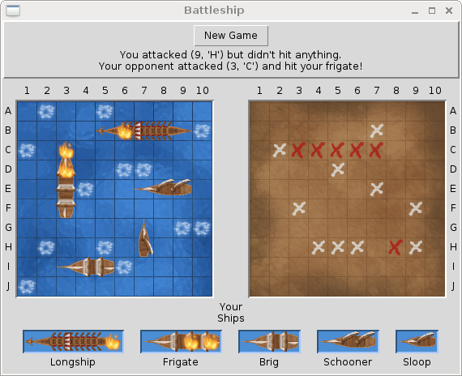
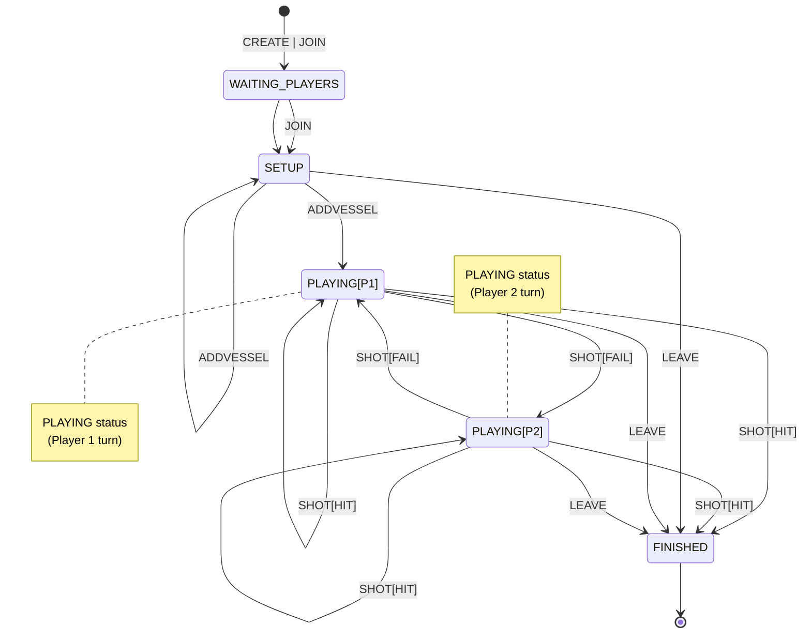

# Enfonsar la Flota

Enfonsar la Flota és un joc de taula clàssic per a dos jugadors. Cada jugador col·loca una flota de vaixells en un tauler de $10\times 10$ caselles, sense que l'altre jugador pugui veure la seva disposició. Els jugadors alternen torns per intentar enfonsar els vaixells de l'adversari, indicant coordenades on creuen que hi ha un vaixell. El joc continua fins que un jugador ha enfonsat tots els vaixells de l'altre.

<figure>
  
  <figcaption>Tauler d'Enfonsar la Flota (extret de <a href="https://www.deviantart.com/littlefiredragon/art/Battleship-494367976">devianart</a>)</figcaption>
</figure>

En el cas de la pràctica, definirem les següents particularitats del joc:
- Tindrem l'opció de jugar contra un oponent humà (__AI__ desactivat) o contra la màquina (__AI__ actiu). 
- El tauler no estarà restringit a $10\times 10$, sinó a una mida $W\times H$, essent $W$ el nombre de **columnes** i $H$ el nombre de **files**. Els valors de $W$ i $H$ es fixaran en la creació de cada partida.
- El nombre de vaixells també dependrà de cada partida, en la que s'indicarà quantes instàncies de cada tipus de vaixell podrem ubicar al tauler. El tipus de vaixell $T_i$ marcarà la seva mida:
  - **$T_1$**: Longship (5 caselles)
  - **$T_2$**: Frigate (4 caselles)
  - **$T_3$**: Brig (3 caselles)
  - **$T_4$**: Schooner (3 caselles)
  - **$T_5$**: Sloop (2 caselles)
- Els vaixells es podran ubicar en vertical i/o horitzontal.

## Definició del joc

En aquest apartat es descriu a alt nivell el funcionament del joc que implementarem. Podeu trobar els detalls d'implementació en els següents documents:
- [Protocol](./protocol.md): Definició de l'intercanvi de missatges i la seva descripció a baix nivell.
- [Missatges](./messages.md): Definició dels codis de missatge i els errors relacionats.
- [Errors](./errors.md): Definició dels missatges i codis d'error.
- [Tauler](./board.md): Descripció de la representació dels taulers de joc.

Cal tenir en compte que no hi haurà persistència de dades en el __servidor__, per tant, si es tanca i s'obre un nou servidor, es perdrà tota la informació de partides i jugadors.

### Fases d'una partida

Un cop es crea una partida, ja sigui de forma automàtica per part del __servidor__, o bé per part d'un __client__ amb la comanda `CREATE`, aquesta passarà a l'estat de `WAITING_PLAYERS`, en que s'esperarà a que tingui els jugadors assignats. Cal tenir en compte que en partides amb un sol jugador (__AI__ desactivada), aquesta fase es saltarà automàticament, ja que el jugador que ha creat la partida (o que ha fet que el __servidor__ la creés) ja quedarà assignat automàticament.

Un cop hi ha assignats tots els jugadors, la partida passa a l'estat de `SETUP`, en el qual els jugadors han de posicionar els seus vaixells on vulguin. Aquesta fase acabarà en el moment que tots els jugadors han ubicat tots els seus vaixells.

Un cop tots els vaixells han estat ubicats, el joc passa a la fase de `PLAYING`. En aquesta fase, els jugadors aniran disparant (`SHOT`) a les caselles on creuen que el seu oponent (humà o no) ha posat els seus vaixells. Si un jugador encerta un vaixell (`HIT`), tornarà a disparar, mentre que si ha fallat (`FAIL`) el torn passarà a l'altre jugador. Aquesta fase finalitza en el moment que un jugador ha enfonsat tots els vaixells del seu oponent.

Un cop enfonsats tots els vaixells d'un jugador, el joc passa a la fase `FINISHED`. També s'arriba a aquesta fase en qualsevol moment si un jugador deixa la partida (`LEAVE`).

A continuació es mostren els diferents estats del joc:

El __client__ pot demanar en qualsevol moment l'estat del joc amb un missatge `GETSTATUS`, en el que se li indicarà tant l'estat en el que es troba el joc, com el tauler del jugador (ubicació vaixells) com el del contrincant (caselles amb `HIT` i amb `FAIL` de les jugades realitzades). A més a més, en cada estat del joc es proporcionarà informació rellevant de l'estat. Tota la informació es troba detallada en el missatge `GAMESTATUS` del [protocol](./protocol.md).

### Exemples de seqüències de crides

#### Partida amb un sol jugador i creació automàtica

El següent diagrama de seqüència mostra una partida d'un jugador contra el servidor (AI actiu), en la que el servidor crea el joc automàticament (paràmetres per defecte). La disposició dels vaixells és la de la figura del tauler d'exemple mostrada en la descripció del joc. Cal tenir en compte que si la opció de jugador contra jugador està implementada, el JOIN pot afegir-nos a una partida existent, però assumim que no és el cas en aquest exemple.

```mermaid
  sequenceDiagram

    note over Client,Servidor: Ens afegim a una partida. <BR/>El servidor la crearà automàticament.

    Client->>+Servidor: JOIN ("SuperPlayer")
    Servidor-->>-Client: OK (10001, 20013)
        
    note over Client,Servidor: Quan la partida tingui tots els jugadors,<br/>el servidor notificarà el canvi d'estat del joc.

    Servidor->>Client: GAMESTATUS (2, <board1>, <board2>, 0, 0, 1, 1, 1, 1, 1)

    note over Client,Servidor: Obtenim la configuració de la partida.
    Client->>+Servidor: GETCONFIG (10001, 20013)
    Servidor-->>-Client: GAMECONFIG (10, 10, 1, 1, 1, 1, 1)    

    note over Client,Servidor: Afegim els diferents vaixells.
    Client->>+Servidor: ADDVESSEL (10001, 20013, 1, 2, 5, 2, 9)
    Servidor-->>-Client: OK (10001, 20013)
    Client->>+Servidor: ADDVESSEL (10001, 20013, 2, 3, 3, 6, 3)
    Servidor-->>-Client: OK (10001, 20013)
    Client->>+Servidor: ADDVESSEL (10001, 20013, 3, 9, 3, 9, 5)
    Servidor-->>-Client: OK (10001, 20013)
    Client->>+Servidor: ADDVESSEL (10001, 20013, 4, 5, 7, 5, 9)
    Servidor-->>-Client: OK (10001, 20013)
    Client->>+Servidor: ADDVESSEL (10001, 20013, 5, 7, 7, 8, 7)
    Servidor-->>-Client: OK (10001, 20013)
    
    note over Client,Servidor: Quan la configuració s'hagi finalitzat,<br/>el servidor notificarà el canvi d'estat del joc.

    Servidor->>Client: GAMESTATUS (3, <board1>, <board2>, 1, 0)

    note over Client,Servidor: Fem les notres jugades. Mentre tenim un Hit anem tirant.

    Client->>+Servidor: SHOT (10001, 20013, 3, 7)
    Servidor-->>-Client: HIT (0)

    Servidor->>Client: GAMESTATUS (3, <board1>, <board2>, 1, 0)

    Client->>+Servidor: SHOT (10001, 20013, 3, 8)
    Servidor-->>-Client: HIT (1)

    Servidor->>Client: GAMESTATUS (3, <board1>, <board2>, 1, 0)

    Client->>+Servidor: SHOT (10001, 20013, 3, 9)
    Servidor-->>-Client: FAIL ()

    Servidor->>Client: GAMESTATUS (3, <board1>, <board2>, 0, 1)
    
    note over Client,Servidor: Després d'haver fallat, el servidor notificarà<br/>el canvi d'estat del joc indicant que no és el nostre torn.
    note over Client,Servidor: Per cada moviment de l'oponent rebrem una actualització<br/>de l'estat.
    Servidor->>Client: GAMESTATUS (3, <board1>, <board2>, 0, 1)
    Servidor->>Client: GAMESTATUS (3, <board1>, <board2>, 0, 1)
    Servidor->>Client: GAMESTATUS (3, <board1>, <board2>, 1, 0)

    note over Client,Servidor: Després que l'oponent hagi fallat, el servidor notificarà<br/>el canvi d'estat del joc indicant que torna a ser nostre torn.

    Client->>+Servidor: SHOT (10001, 20013, 1, 1)
    Servidor-->>-Client: HIT (0)

    Servidor->>Client: GAMESTATUS (3, <board1>, <board2>, 1, 0)

    Client->>+Servidor: SHOT (10001, 20013, 2, 1)
    Servidor-->>-Client: HIT (0)

    Servidor->>Client: GAMESTATUS (3, <board1>, <board2>, 1, 0)

    Client->>+Servidor: SHOT (10001, 20013, 3, 1)
    Servidor-->>-Client: HIT (1)

    Servidor->>Client: GAMESTATUS (4, <board1>, <board2>, 1, 0)

    note over Client,Servidor: Després que un dels jugadors hagi enfonsat l'últim vaixell, <br/> el servidor notificarà el canvi d'estat del joc a finalitzat.

    note over Client,Servidor: Tant si volem iniciar una altra partida, com deixar el joc, <br/> abans haurem de deixar la partida.

    Client->>+Servidor: LEAVE (10001, 20013)
    Servidor-->>-Client: OK (10001, 20013)

```

#### Partida amb un sol jugador i creació manual

El següent diagrama de seqüència mostra una partida d'un jugador contra el servidor (AI actiu), en la que el jugador crea una partida personalitzada. Per simplificar, treballarem amb un tauler de $9\times 9$, i la mateixa disposició dels vaixells que en el cas anterior. Es mostra la part diferent del cas anterior.

```mermaid
  sequenceDiagram

    note over Client,Servidor: Creem una nova partida. <BR/>El servidor ens hi afegeix automàticament.

    Client->>+Servidor: CREATE ("SuperPlayer")
    Servidor-->>-Client: OK (10001, 20013)
        
    note over Client,Servidor: Quan la partida tingui tots els jugadors,<br/>el servidor notificarà el canvi d'estat del joc.

    Servidor->>Client: GAMESTATUS (2, <board1>, <board2>, 0, 0, 1, 1, 1, 1, 1)

    note over Client,Servidor: Obtenim la configuració de la partida.
    Client->>+Servidor: GETCONFIG (10001, 20013)
    Servidor-->>-Client: GAMECONFIG (10, 10, 1, 1, 1, 1, 1)    

    note over Client,Servidor: Afegim els diferents vaixells.
    Client->>+Servidor: ADDVESSEL (10001, 20013, 1, 2, 5, 2, 9)
    Servidor-->>-Client: OK (10001, 20013)
    Client->>+Servidor: ADDVESSEL (10001, 20013, 2, 3, 3, 6, 3)
    Servidor-->>-Client: OK (10001, 20013)
    Client->>+Servidor: ADDVESSEL (10001, 20013, 3, 9, 3, 9, 5)
    Servidor-->>-Client: OK (10001, 20013)
    Client->>+Servidor: ADDVESSEL (10001, 20013, 4, 5, 7, 5, 9)
    Servidor-->>-Client: OK (10001, 20013)
    Client->>+Servidor: ADDVESSEL (10001, 20013, 5, 7, 7, 8, 7)
    Servidor-->>-Client: OK (10001, 20013)
    
    note over Client,Servidor: Quan la configuració s'hagi finalitzat,<br/>el servidor notificarà el canvi d'estat del joc.

    Servidor->>Client: GAMESTATUS (3, <board1>, <board2>, 1, 0)

    note over Client,Servidor: Fem les notres jugades. Mentre tenim un Hit anem tirant.

    Client->>+Servidor: SHOT (10001, 20013, 3, 7)
    Servidor-->>-Client: HIT (0)

    Servidor->>Client: GAMESTATUS (3, <board1>, <board2>, 1, 0)

    Client->>+Servidor: SHOT (10001, 20013, 3, 8)
    Servidor-->>-Client: HIT (1)

    Servidor->>Client: GAMESTATUS (3, <board1>, <board2>, 1, 0)

    Client->>+Servidor: SHOT (10001, 20013, 3, 9)
    Servidor-->>-Client: FAIL ()

    Servidor->>Client: GAMESTATUS (3, <board1>, <board2>, 0, 1)
    
    note over Client,Servidor: Després d'haver fallat, el servidor notificarà<br/>el canvi d'estat del joc indicant que no és el nostre torn.
    note over Client,Servidor: Per cada moviment de l'oponent rebrem una actualització<br/>de l'estat.
    Servidor->>Client: GAMESTATUS (3, <board1>, <board2>, 0, 1)
    Servidor->>Client: GAMESTATUS (3, <board1>, <board2>, 0, 1)
    Servidor->>Client: GAMESTATUS (3, <board1>, <board2>, 1, 0)

    note over Client,Servidor: Després que l'oponent hagi fallat, el servidor notificarà<br/>el canvi d'estat del joc indicant que torna a ser nostre torn.

    Client->>+Servidor: SHOT (10001, 20013, 1, 1)
    Servidor-->>-Client: HIT (0)

    Servidor->>Client: GAMESTATUS (3, <board1>, <board2>, 1, 0)

    Client->>+Servidor: SHOT (10001, 20013, 2, 1)
    Servidor-->>-Client: HIT (0)

    Servidor->>Client: GAMESTATUS (3, <board1>, <board2>, 1, 0)

    Client->>+Servidor: SHOT (10001, 20013, 3, 1)
    Servidor-->>-Client: HIT (1)

    Servidor->>Client: GAMESTATUS (4, <board1>, <board2>, 1, 0)

    note over Client,Servidor: Després que un dels jugadors hagi enfonsat l'últim vaixell, <br/> el servidor notificarà el canvi d'estat del joc a finalitzat.

    note over Client,Servidor: Tant si volem iniciar una altra partida, com deixar el joc, <br/> abans haurem de deixar la partida.

    Client->>+Servidor: LEAVE (10001, 20013)
    Servidor-->>-Client: OK (10001, 20013)

```

