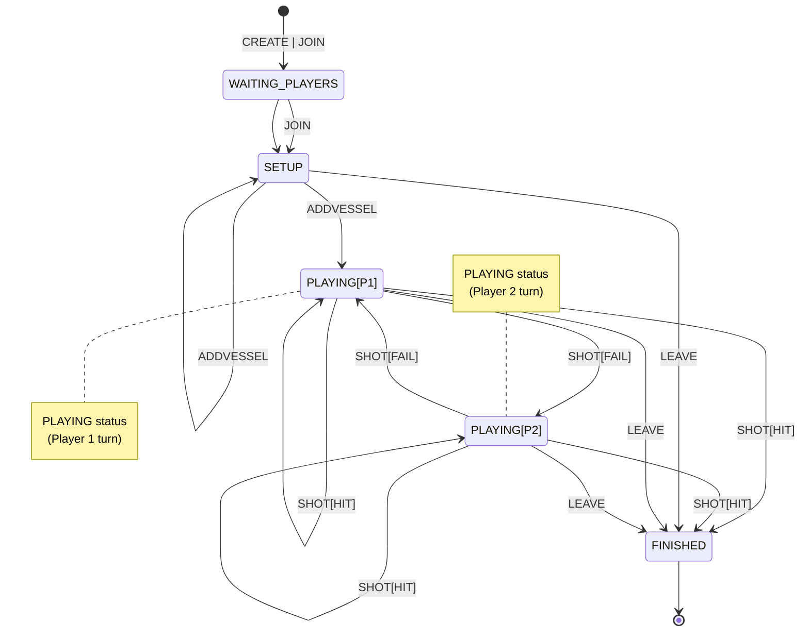
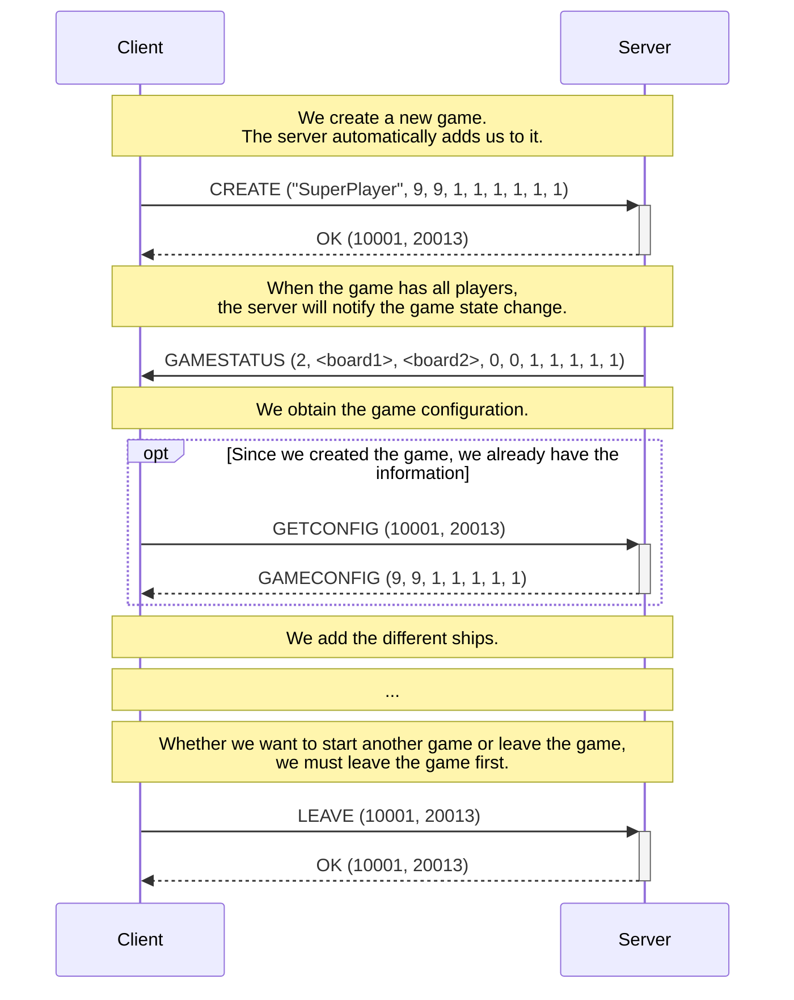

# Battleship

Battleship is a classic two-player board game. Each player places a fleet of ships on a $10 \times 10$ grid, without the other player being able to see their setup. The players take turns trying to sink the opponent's ships by calling out coordinates where they believe a ship might be. The game continues until one player has sunk all of the other player's ships.

<figure>
  
  <figcaption>Battleship board (taken from <a href="https://www.deviantart.com/littlefiredragon/art/Battleship-494367976">DeviantArt</a>)</figcaption>
</figure>

For this practice, we define the following game specifics:

- Players can choose to play against a human opponent (**AI** off) or against the machine (**AI** on).
- The board size is not restricted to $10 \times 10$, but can be customized to a $W \times H$ grid, where $W$ is the number of **columns** and $H$ is the number of **rows**. The values for $W$ and $H$ are set at the beginning of each game.
- The number of ships also depends on the game setup, specifying how many instances of each ship type can be placed on the board. The ship types $T_i$ determine their size:
  - **$T_1$**: Longship (5 cells)
  - **$T_2$**: Frigate (4 cells)
  - **$T_3$**: Brig (3 cells)
  - **$T_4$**: Schooner (3 cells)
  - **$T_5$**: Sloop (2 cells)
- Ships can be placed vertically and/or horizontally.

## Game Definition

This section describes the high-level mechanics of the game we will implement. You can find the implementation details in the following documents:

- [Protocol](./protocol_en.md): Definition of message exchanges and low-level descriptions.
- [Messages](./messages_en.md): Definition of message codes and related errors.
- [Errors](./errors_en.md): Definition of error messages and codes.
- [Board](./board_en.md): Description of how game boards are represented.

Note that there will be no data persistence on the **server**, meaning if the server is closed and reopened, all game and player data will be lost.

### Game Phases

Once a game is created, either automatically by the **server** or manually by a **client** using the `CREATE` command, it enters the `WAITING_PLAYERS` state, where it waits for players to be assigned. Note that in games with only one player (**AI** off), this phase is skipped automatically since the player who created the game (or requested the **server** to create it) is assigned automatically.

Once all players have been assigned, the game enters the `SETUP` phase, where players must place their ships. This phase ends when all players have placed their ships.

Once all ships are placed, the game enters the `PLAYING` phase. In this phase, players take turns (`SHOT`) targeting squares where they believe the opponent's ships are located. If a player hits a ship (`HIT`), they get another turn, whereas if they miss (`FAIL`), the turn passes to the other player. This phase ends when one player sinks all the opponent's ships.

After all ships of a player are sunk, the game moves to the `FINISHED` phase. This phase is also reached if a player leaves the game at any point (`LEAVE`).

Below are the different game states:

The **client** can request the current game status at any time using the `GETSTATUS` message, which will provide both the current game state, as well as the player’s board (ship locations) and the opponent’s board (with `HIT` and `FAIL` marks for previous moves). Relevant information about the game state will also be provided. All details are included in the `GAMESTATUS` message in the [protocol](./protocol_en.md).

### Example Call Sequences

#### Single-player Game with Automatic Creation

The following sequence diagram shows a game between a single player and the server (with AI active), where the server automatically creates the game with default parameters. The ship arrangement follows the example board shown in the game description. Note that if the player-vs-player option is implemented, the `JOIN` command could add us to an existing game, but we assume this is not the case in this example.

```mermaid
  sequenceDiagram

    note over Client,Server: Joining a game. <BR/>The server will create it automatically.

    Client->>+Server: JOIN ("SuperPlayer")
    Server-->>-Client: OK (10001, 20013)

    note over Client,Server: When the game has all players,<br/>the server will notify the game state change.

    Server->>Client: GAMESTATUS (2, <board1>, <board2>, 0, 0, 1, 1, 1, 1, 1)

    note over Client,Server: We obtain the game configuration.
    Client->>+Server: GETCONFIG (10001, 20013)
    Server-->>-Client: GAMECONFIG (10, 10, 1, 1, 1, 1, 1)

    note over Client,Server: We add the different ships.
    Client->>+Server: ADDVESSEL (10001, 20013, 1, 2, 5, 2, 9)
    Server-->>-Client: OK (10001, 20013)
    Client->>+Server: ADDVESSEL (10001, 20013, 2, 3, 3, 6, 3)
    Server-->>-Client: OK (10001, 20013)
    Client->>+Server: ADDVESSEL (10001, 20013, 3, 9, 3, 9, 5)
    Server-->>-Client: OK (10001, 20013)
    Client->>+Server: ADDVESSEL (10001, 20013, 4, 5, 7, 5, 9)
    Server-->>-Client: OK (10001, 20013)
    Client->>+Server: ADDVESSEL (10001, 20013, 5, 7, 7, 8, 7)
    Server-->>-Client: OK (10001, 20013)

    note over Client,Server: When the setup is finished,<br/>the server will notify the game state change.

    Server->>Client: GAMESTATUS (3, <board1>, <board2>, 1, 0)

    note over Client,Server: We make our moves. As long as we hit, we keep going.

    Client->>+Server: SHOT (10001, 20013, 3, 7)
    Server-->>-Client: HIT (0)

    Server->>Client: GAMESTATUS (3, <board1>, <board2>, 1, 0)

    Client->>+Server: SHOT (10001, 20013, 3, 8)
    Server-->>-Client: HIT (1)

    Server->>Client: GAMESTATUS (3, <board1>, <board2>, 1, 0)

    Client->>+Server: SHOT (10001, 20013, 3, 9)
    Server-->>-Client: FAIL ()

    Server->>Client: GAMESTATUS (3, <board1>, <board2>, 0, 1)

    note over Client,Server: After missing, the server will notify<br/>the game state change indicating that it's not our turn.
    note over Client,Server: For each opponent's move, we will receive an update<br/>on the state.
    Server->>Client: GAMESTATUS (3, <board1>, <board2>, 0, 1)
    Server->>Client: GAMESTATUS (3, <board1>, <board2>, 0, 1)
    Server->>Client: GAMESTATUS (3, <board1>, <board2>, 1, 0)

    note over Client,Server: After the opponent has missed, the server will notify<br/>the game state change indicating that it's our turn again.

    Client->>+Server: SHOT (10001, 20013, 1, 1)
    Server-->>-Client: HIT (0)

    Server->>Client: GAMESTATUS (3, <board1>, <board2>, 1, 0)

    Client->>+Server: SHOT (10001, 20013, 2, 1)
    Server-->>-Client: HIT (0)

    Server->>Client: GAMESTATUS (3, <board1>, <board2>, 1, 0)

    Client->>+Server: SHOT (10001, 20013, 3, 1)
    Server-->>-Client: HIT (1)

    Server->>Client: GAMESTATUS (4, <board1>, <board2>, 1, 0)

    note over Client,Server: After one player sinks the last ship,<br/>the server will notify the game state change to finished.

    note over Client,Server: Whether we want to start a new game or leave the game,<br/>we must leave the game first.

    Client->>+Server: LEAVE (10001, 20013)
    Server-->>-Client: OK (10001, 20013)

```

#### Single-player Game with Manual Creation

Here is the translated document in English:

---

The following sequence diagram shows a game between a single player and the server (with AI active), where the player creates a custom game. To simplify, we will work with a $9\times 9$ board, and the same ship arrangement as in the previous case. This shows the part that differs from the previous case.

#### Two-player Game

Here is the translated document in English:

---

The following sequence diagram shows a game with two players (AI deactivated). The game must be created manually, otherwise, the server will create it with AI active. To simplify, we will use a $3\times 3$ board with only two ships: one of type $T_3$ and one of type $T_4$.

```mermaid
  sequenceDiagram

    note over Client1,Server: We create a new game. <BR/>The server automatically adds us to it.

    Client1->>+Server: CREATE ("GameOwner", 3, 3, 0, 0, 1, 0, 1, 0)
    Server-->>-Client1: OK (10001, 20013)

    note over Client2,Server: We join a game.

    Client2->>+Server: JOIN ("OtherPlayer")
    Server-->>-Client2: OK (10005, 20013)

    note over Client1,Client2: When the game has all players,<br/>the server will notify the game state change.

    Server->>Client1: GAMESTATUS (2, <board1>, <board2>, 0, 0, 0, 0, 1, 0, 1)

    Server->>Client2: GAMESTATUS (2, <board1>, <board2>, 0, 0, 0, 0, 1, 0, 1)

    note over Client1,Client2: We obtain the game configuration.

    opt Since we created the game, we already have the information
    Client1->>+Server: GETCONFIG (10001, 20013)
    Server-->>-Client1: GAMECONFIG (3, 3, 0, 0, 1, 0, 1)
    end

    Client2->>+Server: GETCONFIG (10005, 20013)
    Server-->>-Client2: GAMECONFIG (3, 3, 0, 0, 1, 0, 1)

    note over Client1,Client2: The players add their ships.
    Client1->>+Server: ADDVESSEL (10001, 20013, 3, 1, 1, 3, 1)
    Server-->>-Client1: OK (10001, 20013)

    Client2->>+Server: ADDVESSEL (10005, 20013, 3, 1, 3, 3, 3)
    Server-->>-Client2: OK (10005, 20013)

    Client2->>+Server: ADDVESSEL (10005, 20013, 5, 2, 2, 3, 2)
    Server-->>-Client2: OK (10005, 20013)

    note over Client1,Client2: Client2 has finished the setup.<br/>The server notifies the state change. The number of remaining ships changes for each player.

    Server->>Client1: GAMESTATUS (2, <board1>, <board2>, 0, 1, 0, 0, 0, 0, 1)
    Server->>Client2: GAMESTATUS (2, <board1>, <board2>, 0, 1, 0, 0, 0, 0, 0)

    Client1->>+Server: ADDVESSEL (10001, 20013, 5, 3, 2, 3, 3)
    Server-->>-Client1: OK (10001, 20013)

    note over Client1,Client2: Once Client1 finishes the setup,<br/>the server notifies the game state change.

    Server->>Client1: GAMESTATUS (3, <board1>, <board2>, 1, 0)
    Server->>Client2: GAMESTATUS (3, <board1>, <board2>, 0, 1)

    note over Client1,Server: It's player 1's turn. While they have a hit, they continue shooting.

    Client1->>+Server: SHOT (10001, 20013, 1, 2)
    Server-->>-Client1: FAIL ()

    note over Client1,Client2: Turn change
    Server->>Client1: GAMESTATUS (3, <board1>, <board2>, 0, 1)
    Server->>Client2: GAMESTATUS (3, <board1>, <board2>, 1, 0)

    note over Client2,Server: It's player 2's turn. While they have a hit, they continue shooting.

    Client2->>+Server: SHOT (10005, 20013, 1, 1)
    Server-->>-Client2: HIT (0)

    Server->>Client1: GAMESTATUS (3, <board1>, <board2>, 0, 1)
    Server->>Client2: GAMESTATUS (3, <board1>, <board2>, 1, 0)

    Client2->>+Server: SHOT (10005, 20013, 2, 1)
    Server-->>-Client2: HIT (0)

    Server->>Client1: GAMESTATUS (3, <board1>, <board2>, 0, 1)
    Server->>Client2: GAMESTATUS (3, <board1>, <board2>, 1, 0)

    Client2->>+Server: SHOT (10005, 20013, 3, 1)
    Server-->>-Client2: HIT (1)

    Server->>Client1: GAMESTATUS (3, <board1>, <board2>, 0, 1)
    Server->>Client2: GAMESTATUS (3, <board1>, <board2>, 1, 0)

    Client2->>+Server: SHOT (10005, 20013, 1, 3)
    Server-->>-Client2: FAIL ()

    note over Client1,Client2: Turn change
    Server->>Client1: GAMESTATUS (3, <board1>, <board2>, 1, 0)
    Server->>Client2: GAMESTATUS (3, <board1>, <board2>, 0, 1)

    note over Client1,Server: It's player 1's turn. While they have a hit, they continue shooting.

    Client1->>+Server: SHOT (10001, 20013, 3, 1)
    Server-->>-Client1: FAIL ()

    note over Client1,Client2: Turn change
    Server->>Client1: GAMESTATUS (3, <board1>, <board2>, 0, 1)
    Server->>Client2: GAMESTATUS (3, <board1>, <board2>, 1, 0)

    note over Client2,Server: It's player 2's turn. While they have a hit, they continue shooting.

    Client2->>+Server: SHOT (10005, 20013, 3, 2)
    Server-->>-Client2: HIT (0)

    Server->>Client1: GAMESTATUS (3, <board1>, <board2>, 0, 1)
    Server->>Client2: GAMESTATUS (3, <board1>, <board2>, 1, 0)

    Client2->>+Server: SHOT (10005, 20013, 3, 3)
    Server-->>-Client2: HIT (1)

    note over Client1,Client2: Client2 has sunk Client1's last ship.<br/>The game ends and the server notifies the game state change.
    Server->>Client1: GAMESTATUS (4, <board1>, <board2>, 0, 1)
    Server->>Client2: GAMESTATUS (4, <board1>, <board2>, 1, 0)

    note over Client1,Client2: Whether we want to start another game or leave the game,<br/>we must leave the game first.

    Client1->>+Server: LEAVE (10001, 20013)
    Server-->>-Client1: OK (10001, 20013)

    Client2->>+Server: LEAVE (10005, 20013)
    Server-->>-Client2: OK (10005, 20013)

```

