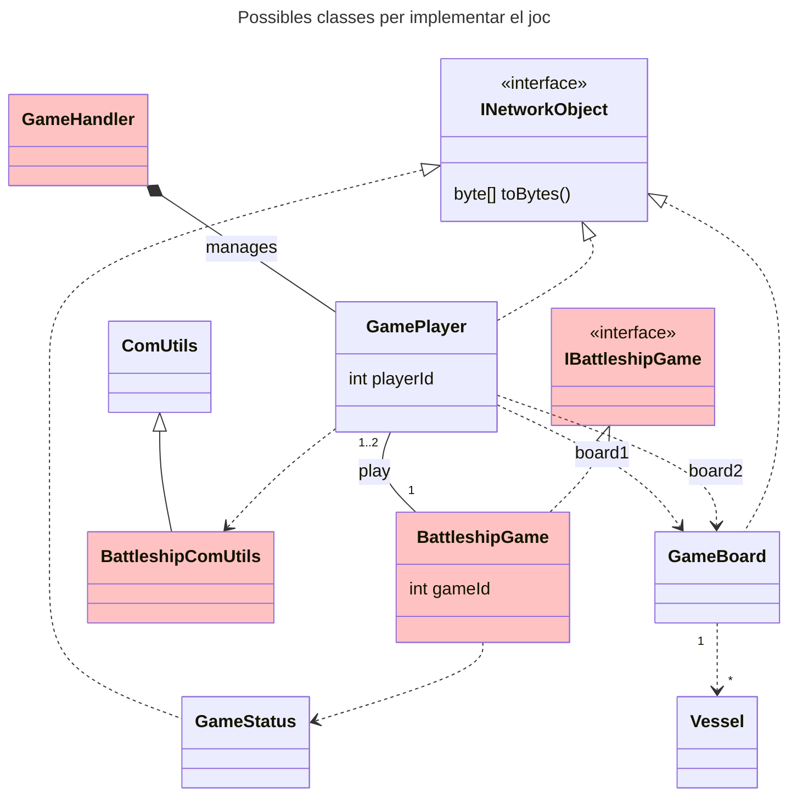

En aquesta sessió clarificarem els dubtes sobre la codificació dels missatges i el protocol en si. També començarem la codificació de la pràctica.

### Sessió 1

En aquesta sessió començarem a veure 

#### Deures:
* Realitzar la funcio per llegir el tipus de dada "string variable"
* Fer les primeres trames (Hello, Admit, etc) a Servidor i Client (cadascuna on toqui) i comprovar la comunicació entre ambdós.

