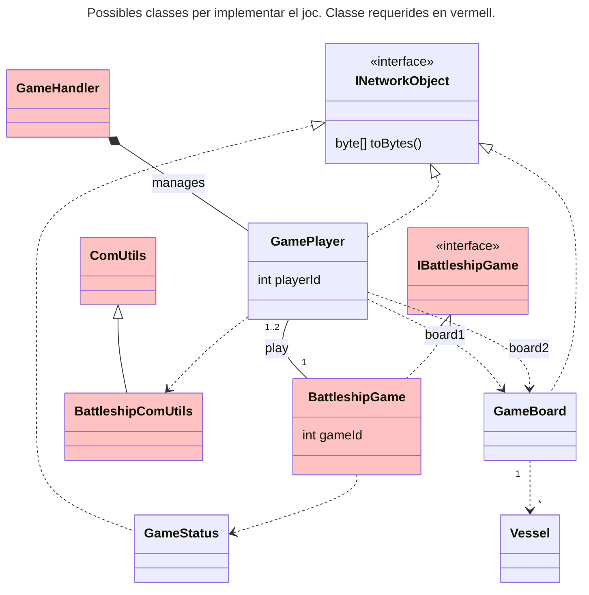

# Session 1  

In this session, we will begin implementing the communication protocol between the **Client** and the **Server**. For communications, we will use **Sockets**, so we recommend reviewing the [Java Sockets documentation](https://docs.oracle.com/javase/7/docs/api/java/net/Socket.html).  

## Objectives  

- Clarify any doubts about the protocol and messages  
- Understand the concept of sockets  
- Start implementing the reading and writing of protocol messages  
- Create unit tests to verify the messages  
- Execute the provided code on multiple machines  


## Game Implementation  

The implementation of the project must follow the Java style guide, and code quality, as well as its organization, will be evaluated. You have freedom in how to organize the code, but there are certain classes that must exist. The following class diagram presents a possible organization of the code into classes. Some classes are mandatory, some are already provided as part of the assignment, and these are highlighted in **red**.  




- **GameHandler:** This is the server class responsible for handling communication with clients. A new **GameHandler** instance will be assigned to each client that connects to the server. Each instance of **GameHandler** runs in a separate thread.  

- **BattleshipComUtils:** This class must extend the **ComUtils** class provided as part of the assignment. It will handle reading and writing through the socket. To simplify this process, we suggest some small modifications to the provided **ComUtils** class in [this guide](../Guies/updateComUtils_en.md).  

- **IBattleshipGame:** A Java interface that defines the basic actions for implementing the Battleship game. You can find this interface [here](../Guies/interface.md).  

- **BattleshipGame:** The server-side implementation of the game's logic. This class will be responsible for managing the game state and player interactions. Review the game states in the [game description](../Guies/battleship_en.md).  

# Writing and Reading Messages

The `BattleshipComUtils` class must implement writing methods that allow you to convert high-level information (integers, character strings, objects, etc.) into an ordered sequence of bytes that will be sent over the network (written to the output socket). It must also implement methods that enable reading the bytes arriving at the input socket and interpreting them to recover the original information.

This implementation can be approached in many ways. If we look at the `JOIN` message in the protocol, we need a method that the **client** will use to convert `playerName` into a set of bytes to send through the socket to the server, and another method that allows the server to read the bytes from the socket, identify that it is a `JOIN` message, and retrieve the `playerName`.

In the first case, the **client** knows the type of message it wants to write and, therefore, its exact format. In the second case, the **server** will determine the message type when it reads the first byte (**messageType**) and will then act accordingly.

# Writing Unit Tests

To ensure that message encoding and decoding are performed correctly, we ask you to implement at least one unit test for each message. In these tests, we will simulate **sockets** using a file. The steps are:

1. Create an instance of the `BattleshipComUtils` class that uses a file instead of sockets.

```java
public class MyUnitTest {

    @Test
    public void my_message_test() {
        File file = new File("test");
        try {
            file.createNewFile();
            BattleshipComUtils bsComUtils = new BattleshipComUtils(new FileInputStream(file), new FileOutputStream(file));

            // Send data

            // Read data

            // Check data consistency with asserts       
        
        } catch (IOException e) {
            e.printStackTrace();
        }
    }
```

2. Use the writing method to send bytes.  
3. Use the reading method to read the sent bytes.  
4. Verify that the received information is exactly the same as what was sent.  

## Running Code on Multiple Machines

In the previous session, we ran both the server and the client on the same machine but in different terminals. We observed that each time we executed the client, the server displayed a message indicating that a new client had been accepted. In this session, the goal is to repeat the execution, but with the client and server running on different machines.

### Starting the Server

For the server, there will be no differences compared to the previous session. We will execute the server by specifying the port it should listen on. To allow clients to connect, we need to know the IP address of the machine where the server is running. Below is a summary of some ways to find your machine’s IP address. This will be the **host** that clients need to connect to.

#### How to Find a Machine’s IP Address  

##### Windows  
1. Open the **Command Prompt** (Cmd) by pressing `Win + R`, typing `cmd`, and pressing **Enter**.  
2. Run the following command:  
   ```sh
   ipconfig
   ```
3. Look for the IPv4 Address entry under the active network adapter.

#### Mac
1. Open the Terminal from Applications > Utilities > Terminal.
2. Run the following command:

```sh
ifconfig | grep "inet "
```

3. The local IP address will appear after ```inet``` (usually associated with ```en0``` for Wi-Fi).

#### Linux

1. Open a Terminal.
2. Run the following command:
```sh
ip a
```
3. Look for the line containing `inet`, which will show the IP address associated with the active network interface (usually `eth0` or `wlan0`).

### Starting the Client

To start the client, we will do exactly the same as in the previous session, but instead of using `localhost`, we will use the IP obtained in the previous step. The functionality should be exactly the same as in the previous session.

## HomeWork:
* Implement all messages from the protocol
* Implement at least one unit test for each message

