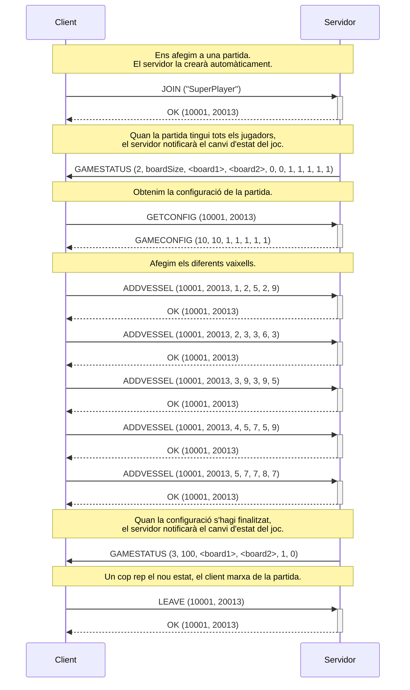

# Sessió 2

Un cop implementats i provats tots els missatges del protocol, en aquesta sessió començarem a intercanviar missatges entre ___Client__ i __Servidor__. En concret, començarem a implementar les primeres fases del joc.

## Objectius

- Gestionar l'acceptació de noves connexions de clients.
- Implementar la creació de la instància de joc per a un nou jugador.
- Implementar les fases inicials del joc.
- Implementar un client.

**NOTA:** En aquesta sessió assumirem les següents simplificacions:
  - Partides un sol jugador
  - No es verifica que el nom del jugador no existeixi [Opcional]

## Inici de la partida

En aquesta sessió avançarem en la implementació del __Servidor__ i començarem a implementar una part del __Client__. A continuació es mostra el diagrama de classes amb les classes que poden estar involucrades (recordeu que moltes de les classes són opcionals). Dins la definició de la interfície `IBattleshipGame` us detallem els mètodes que caldrà implementar.

Seguint l'esquema del protocol mostrat a la [descripció de la pràctica](../Guies/battleship.md), volem implementar la següent part:

Fixeu-vos que assumim que la partida és per a **un sol jugador** i que el servidor **crea la partida automàticament**. Això vol dir que:

- el __Client__ sempre iniciarà la conversa amb el __Servidor__ amb la comanda `JOIN`.
- el __Servidor__ crea la partida i li assigna un `gameId` (inicialment la partida està en el `gameState` `WAITING_PLAYERS (1)`, a l'espera que se li assigni un jugador).
- el __Servidor__ afegeix el __Client__ com a jugador de la nova partida, i li assigna un `playerId`
- el __Servidor__ li comunica al __Client__ l'identificador de la nova partida i el seu identificador de jugador en un missatge `OK`
- donat que la partida és d'un sol jugador, i el __Client__ està assignat a la partida, el __Servidor__ ha de gestionar el canvi d'eststat de la partida `gameState` a `SETUP(2)`.
- Al canviar l'estat de la partida, el __Servidor__ ho notifica al __Client__ amb un missatge `GAME_STATUS`. 

**NOTA:** En aquesta fase de la implementació, no s'espera que hagueu implementat el tauler, per tant podeu enviar tots els bytes del tauler amb un valor $0$.

A continuació es detallen les implementacions més importants als dos costats:

### Servidor

El servidor haurà de gestionar la creació de la partida i l'assignació dels jugadors a ella. Es tracta dels estats inificals del diagrama d'estats (podeu veure el diagrama complet a la [descripció del joc](../Guies/battleship.md)):

En el codi que us hem donat, es crea un objecte `GameHandler` per cada __Client__ que es connecta. Actualment aquest objecte no inicia un nou `Thread`, el que vol dir que les operacions que es facin bloquejaran el bucle del servidor. El primer pas serà convertir la classe `GameHandler` en un nou `Thread`. Per fer-ho, seguiu les indicacions sobre [Threads amb Java](https://ub-gei-sd.github.io/Tema1/JavaThreads1.pdf) de la classe de teoria, fent que la classe `GameHandler` estengui la classe `Thread` o implementi la interfície `Runnable`.

El nou `Thread` gestionarà totes les interaccions amb el __Client__ que s'ha connectat, i per tant, és qui haurà de rebre el missatge `JOIN` inicial. Assumirem que els noms de jugador no estaran mai repetits, per tant no cal afegir aquest control incialment, passant a ser un objectiu opcional d'aquesta sessió.

Cada jugador (en aquest cas només en tindrem un) haurà de tenir accés a la classe `BattleshipGame` que implementarà la dinàmica del joc. Per realitzar aquesta sessió, es demana que implementeu com a mínim els següents mètodes:

- **int getGameState():** Retorna l'estat actual del joc. Per exemple, si estem en la fase `WAITING_PLAYERS` retornarà el valor $1$. Podeu veure els diferents estats en el [protocol del joc](../Guies/protocol.md).
- **int getNumPlayers():** Retorna el nombre de jugadors assignats a la partida.
- **int getPlayerId(int idx):** Retorna l'índex del jugador amb el `playerId` assignat. S'assumeix que el joc té una llista de jugadors amb un màxim de $2$ jugadors, per tant l'índex serà un valor $0$ o $1$. En cas que el `playerId` no sigui de cap dels jugadors de la partida, es retornarà un valor $-1$.
- **boolean notifyStatus(int playerId):** Aquest mètode notificarà l'estat de la partida al jugador amb el `playerId` donat. Això vol dir que li enviarà un missatge de tipus `GAMESTATUS` al __Client__ corresponent a aquest jugador amb tota la informació. Reviseu el [protocol del joc](../Guies/protocol.md) per veure el detall del missatge. En aquests moments, com encara no tenim el tauler implementat, podeu enviar **zeros** a totes les posicions del tauler. Si s'ha pogut enviar el missatge es retornarà el valor **true**, en cas d'error un **false**.
- **void leaveGame(int playerId):** Aquest mètode implementa la sortida del jugador amb `playerId` del joc. Quan un jugador surt del joc (enviant un missatge `LEAVE` al servidor), el joc passa a l'estat de `FINISHED` i es notifica el canvi d'estat a la resta de jugadors.

### Client

El client haurà d'implementar la interacció amb l'usuari. La versió més simple és mitjançant una aplicació de terminal, en la qual es mostri les diferents opcions a l'usuari. Els passos des del punt de vista del client poden ser:

- **Demanar nom jugador:** Inicialment el client demana a l'usuari que li introdueixi per teclat el nom de jugador que vol fer servir.
- **Menú opcions:** Llavors el client mostra un menú d'opcions al usuari, permetent entrar una de les opcions per teclat. Un possible menú d'opcions inicial pot ser:
  - **1.- Unir-se a una partida:** El client enviarà la comanda `JOIN` al servidor i en cas que s'hagi unit satisfactòriament mostrarà el menú de configuració (veure [Treball fora del laboratori](#treball-fora-del-laboratori)).
  - **2.- Sortir:** El client enviarà la comanda `LEAVE` al servidor i finalitzarà la seva execució.

### Treball fora del laboratori:

## Fase de configuració

Implementarem les classes i mètodes relatius a la configuració del joc. 

