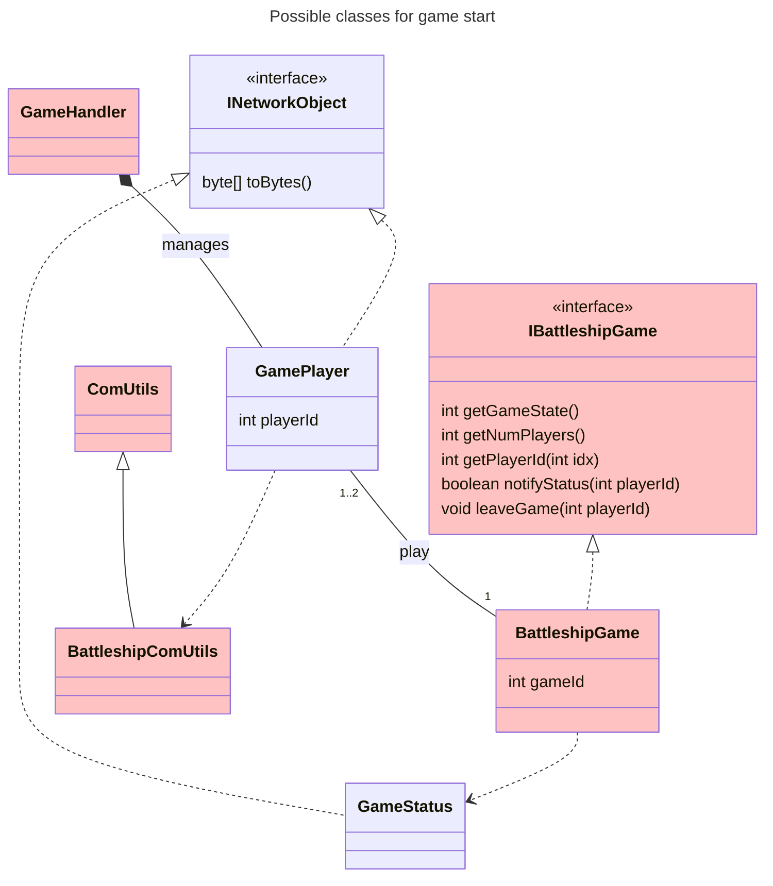
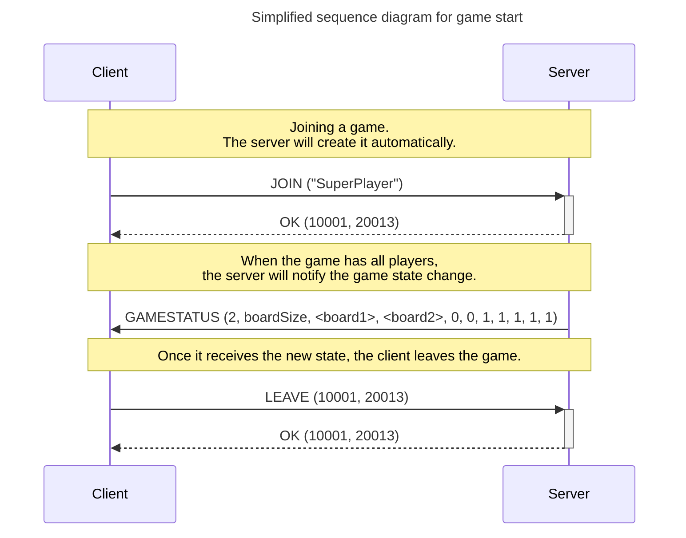
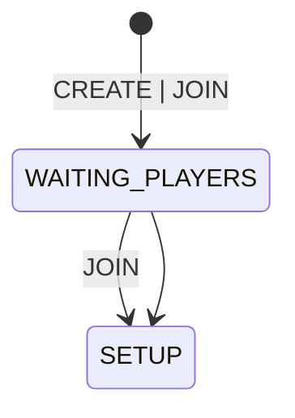
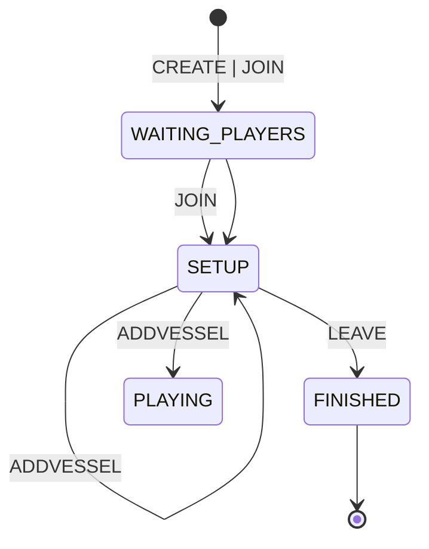
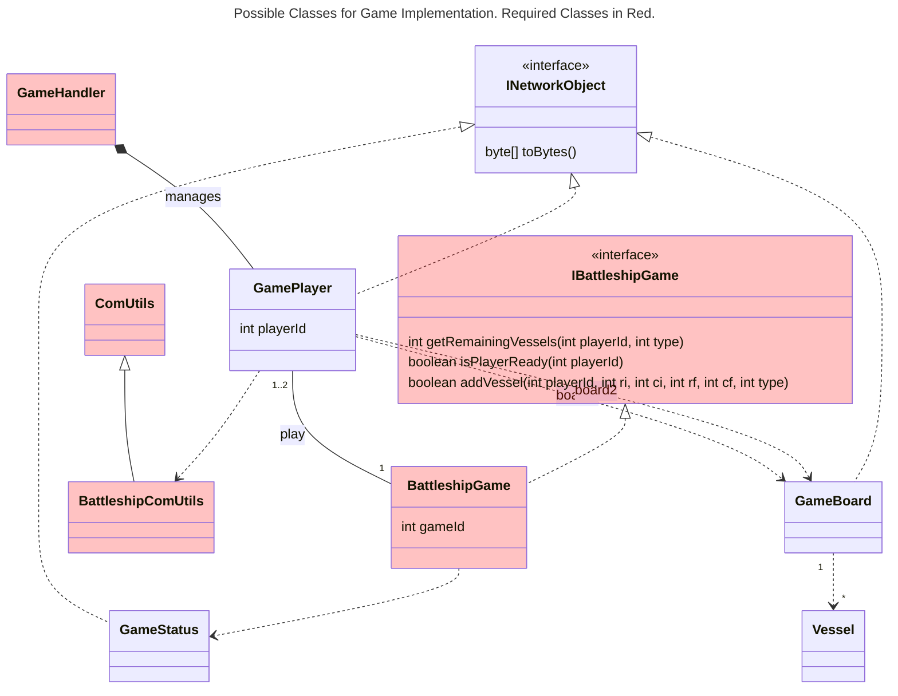
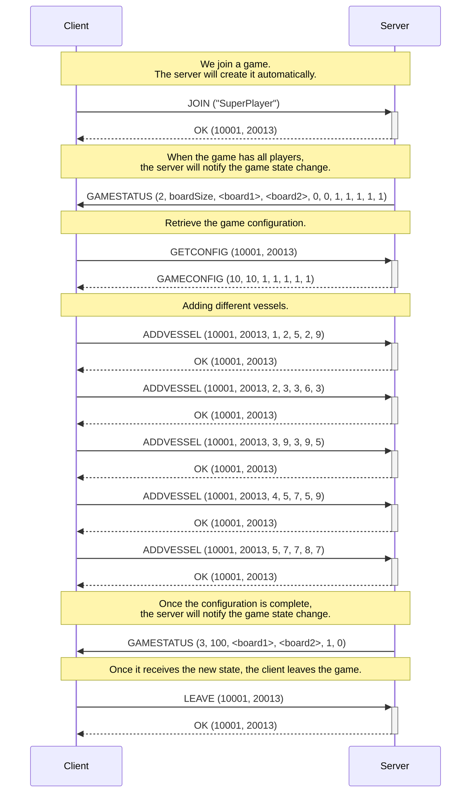

# Session 2

Once all protocol messages have been implemented and tested, in this session, we will start exchanging messages between __Client__ and __Server__. Specifically, we will begin implementing the initial phases of the game.

## Objectives

- Manage the acceptance of new client connections.
- Implement the creation of a game instance for a new player.
- Implement the initial phases of the game.
- Implement a client.

**NOTE:** In this session, we will assume the following simplifications:
  - Single-player games.
  - No verification that the player's name already exists [Optional].

## Game Start

In this session, we will progress in the implementation of the __Server__ and start implementing part of the __Client__. Below is a class diagram showing the classes that may be involved (remember that many of the classes are optional). Within the definition of the `IBattleshipGame` interface, we detail the methods that need to be implemented.

Following the protocol scheme shown in the [project description](../Guies/battleship_en.md), we aim to implement the following section:

Note that we assume the game is for **a single player** and that the server **automatically creates the game**. This means that:

- The __Client__ will always initiate communication with the __Server__ using the `JOIN` command.
- The __Server__ creates the game and assigns it a `gameId` (initially, the game is in `WAITING_PLAYERS (1)`, waiting for a player to be assigned).
- The __Server__ adds the __Client__ as a player in the new game and assigns them a `playerId`.
- The __Server__ communicates to the __Client__ the new game identifier and its player identifier in an `OK` message.
- Since this is a single-player game, and the __Client__ is assigned to the game, the __Server__ must handle changing the game state to `SETUP(2)`.
- Upon changing the game state, the __Server__ notifies the __Client__ with a `GAME_STATUS` message.

**NOTE:** At this stage of implementation, you are not expected to have implemented the game board, so you can send all board bytes with a value of $0$.

Below are the key implementations on both sides:

### Server

The server must handle game creation and player assignment. This corresponds to the initial states in the state diagram (you can see the full diagram in the [game description](../Guies/battleship_en.md)):

In the provided code, a `GameHandler` object is created for each __Client__ that connects. Currently, this object does not start a new `Thread`, meaning operations will block the server loop. The first step will be to convert the `GameHandler` class into a new `Thread`. To do this, follow the guidelines on [Threads in Java](https://ub-gei-sd.github.io/Tema1/JavaThreads1.pdf) from the theory class, making the `GameHandler` class extend `Thread` or implement the `Runnable` interface.

The new `Thread` will handle all interactions with the connected __Client__ and, therefore, will receive the initial `JOIN` message. We assume that player names will never be duplicated, so no initial check is needed, making it an optional goal for this session.

Each player (in this case, only one) must have access to the `BattleshipGame` class, which will implement the game mechanics. For this session, you are required to implement at least the following methods:

- **int getGameState():** Returns the current game state. For example, if the game is in the `WAITING_PLAYERS` phase, it will return $1$. See the [game protocol](../Guies/protocol_en.md) for different states.
- **int getNumPlayers():** Returns the number of players assigned to the game.
- **int getPlayerId(int idx):** Returns the player ID assigned to the given index. The game assumes a list of players with a maximum of $2$, so the index will be $0$ or $1$. If the `playerId` is not in the game, it returns $-1$.
- **boolean notifyStatus(int playerId):** This method notifies the player with `playerId` of the game state by sending a `GAMESTATUS` message to the corresponding __Client__. Since the board is not yet implemented, send **zeros** for all board positions. Returns **true** if the message was sent successfully, **false** otherwise.
- **void leaveGame(int playerId):** Implements a player's exit from the game. When a player sends a `LEAVE` message, the game transitions to `FINISHED`, and the state change is notified to the remaining players.

### Client

The client must implement user interaction, with the simplest version being a terminal application displaying different options. The client steps are:

- **Request player name:** Initially, the client asks the user to enter their player name.
- **Options menu:** The client displays a menu with options and allows keyboard input:
  - **1.- Join a game:** Sends `JOIN` to the server and, upon successful joining, displays the configuration menu (see [Work Outside the Lab](#work-outside-the-lab)).
  - **2.- Exit:** Sends `LEAVE` to the server and terminates execution.

### Work Outside the Lab:

## Configuration Phase

We will implement the classes and methods related to game configuration.

