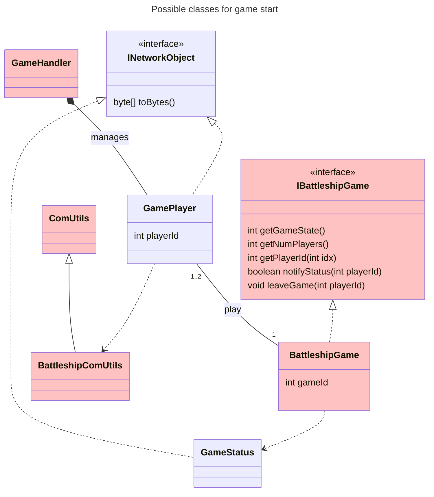
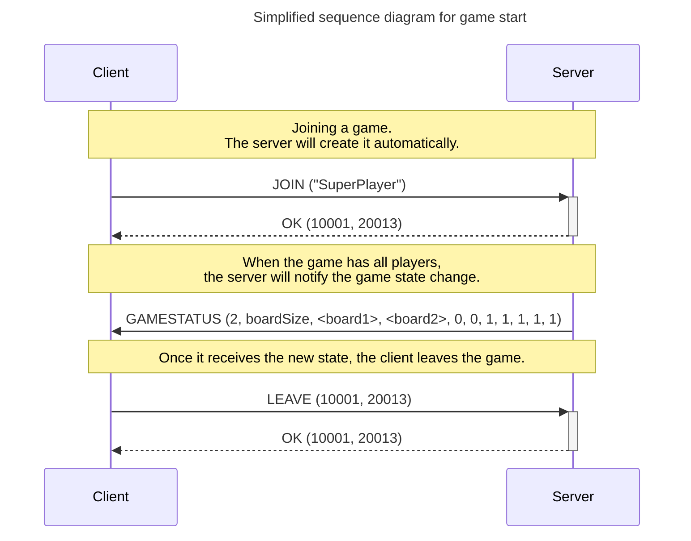
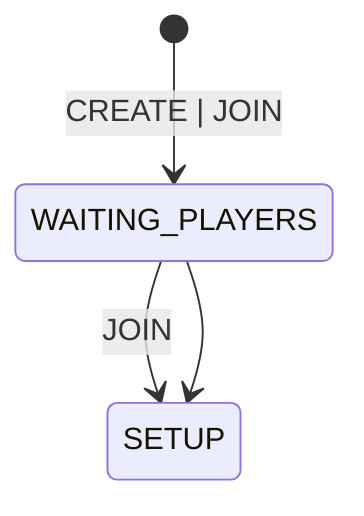
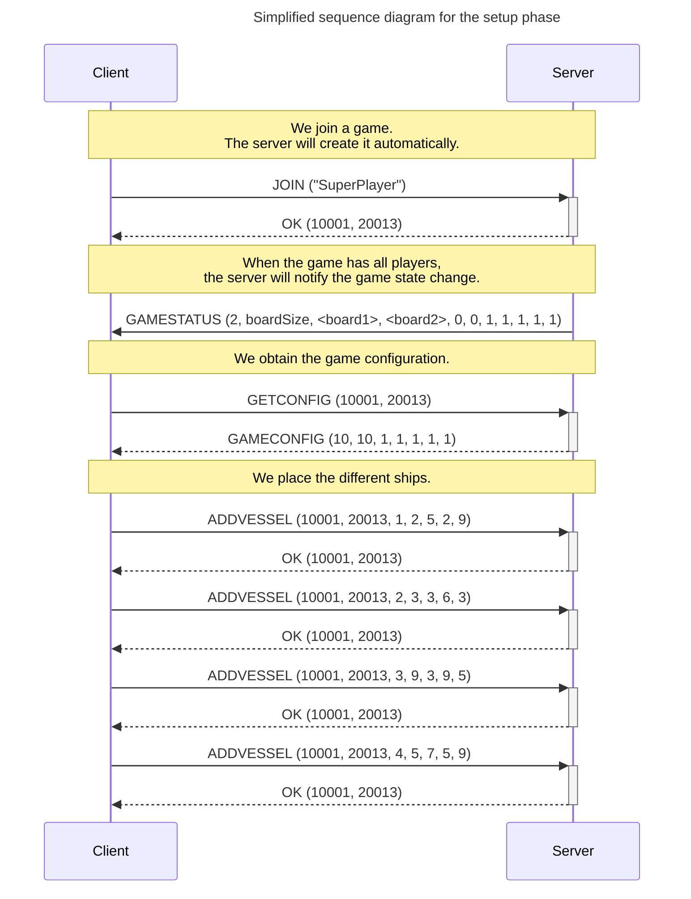
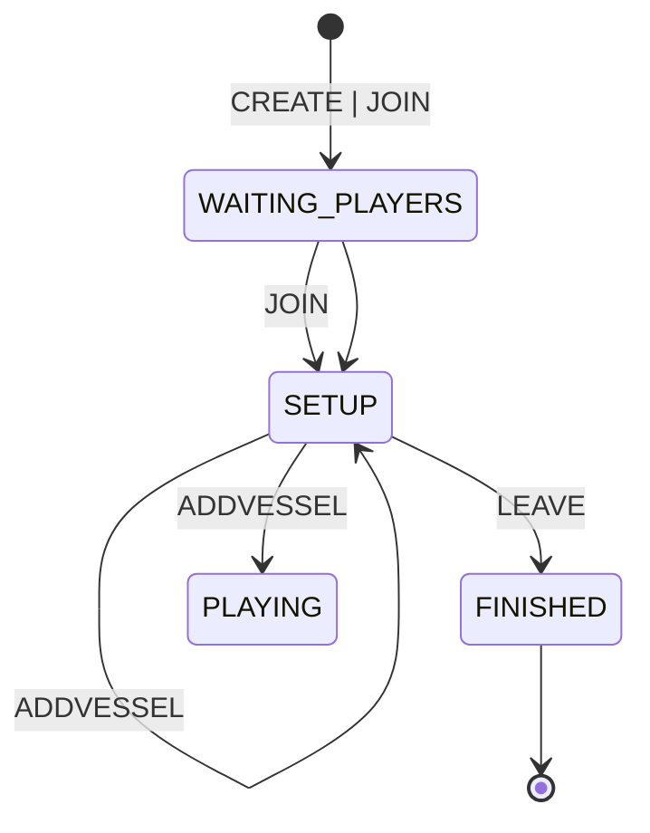

# Session 2

Once all protocol messages have been implemented and tested, in this session, we will start exchanging messages between **Client** and **Server**. Specifically, we will begin implementing the initial phases of the game.

## Objectives

- Manage the acceptance of new client connections.
- Implement the creation of a game instance for a new player.
- Implement the initial phases of the game.
- Implement a client.

**NOTE:** In this session, we will assume the following simplifications:

- Single-player games.
- No verification that the player's name already exists [Optional].

## Game Start

In this session, we will progress in the implementation of the **Server** and start implementing part of the **Client**. Below is a class diagram showing the classes that may be involved (remember that many of the classes are optional). Within the definition of the `IBattleshipGame` interface, we detail the methods that need to be implemented.

Following the protocol scheme shown in the [project description](../Guies/battleship_en.md), we aim to implement the following section:

Note that we assume the game is for **a single player** and that the server **automatically creates the game**. This means that:

- The **Client** will always initiate communication with the **Server** using the `JOIN` command.
- The **Server** creates the game and assigns it a `gameId` (initially, the game is in `WAITING_PLAYERS (1)`, waiting for a player to be assigned).
- The **Server** adds the **Client** as a player in the new game and assigns them a `playerId`.
- The **Server** communicates to the **Client** the new game identifier and its player identifier in an `OK` message.
- Since this is a single-player game, and the **Client** is assigned to the game, the **Server** must handle changing the game state to `SETUP(2)`.
- Upon changing the game state, the **Server** notifies the **Client** with a `GAME_STATUS` message.

**NOTE:** At this stage of implementation, you are not expected to have implemented the game board, so you can send all board bytes with a value of $0$.

Below are the key implementations on both sides:

### Server

The server must handle game creation and player assignment. This corresponds to the initial states in the state diagram (you can see the full diagram in the [game description](../Guies/battleship_en.md)):

In the provided code, a `GameHandler` object is created for each **Client** that connects. Currently, this object does not start a new `Thread`, meaning operations will block the server loop. The first step will be to convert the `GameHandler` class into a new `Thread`. To do this, follow the guidelines on [Threads in Java](https://ub-gei-sd.github.io/Tema1/JavaThreads1.pdf) from the theory class, making the `GameHandler` class extend `Thread` or implement the `Runnable` interface.

The new `Thread` will handle all interactions with the connected **Client** and, therefore, will receive the initial `JOIN` message. We assume that player names will never be duplicated, so no initial check is needed, making it an optional goal for this session.

Each player (in this case, only one) must have access to the `BattleshipGame` class, which will implement the game mechanics. For this session, you are required to implement at least the following methods:

- **int getGameState():** Returns the current game state. For example, if the game is in the `WAITING_PLAYERS` phase, it will return $1$. See the [game protocol](../Guies/protocol_en.md) for different states.
- **int getNumPlayers():** Returns the number of players assigned to the game.
- **int getPlayerId(int idx):** Returns the player ID assigned to the given index. The game assumes a list of players with a maximum of $2$, so the index will be $0$ or $1$. If the `playerId` is not in the game, it returns $-1$.
- **boolean notifyStatus(int playerId):** This method notifies the player with `playerId` of the game state by sending a `GAMESTATUS` message to the corresponding **Client**. Since the board is not yet implemented, send **zeros** for all board positions. Returns **true** if the message was sent successfully, **false** otherwise.
- **void leaveGame(int playerId):** Implements a player's exit from the game. When a player sends a `LEAVE` message, the game transitions to `FINISHED`, and the state change is notified to the remaining players.

### Client

The client must implement user interaction, with the simplest version being a terminal application displaying different options. The client steps are:

- **Request player name:** Initially, the client asks the user to enter their player name.
- **Options menu:** The client displays a menu with options and allows keyboard input:
  - **1.- Join a game:** Sends `JOIN` to the server and, upon successful joining, displays the configuration menu (see [Work Outside the Lab](#work-outside-the-lab)).
  - **2.- Exit:** Sends `LEAVE` to the server and terminates execution.

### Work Outside the Laboratory:

Continuing the work in the laboratory, for the next week, you are asked to implement the setup phase, in which players will place their ships on the game board.

## Setup Phase

In this phase, players position their ships on the board. Following the structure of the tasks in the laboratory, the class diagram below shows the possible classes involved (remember that many of the classes are optional). Within the definition of the `IBattleshipGame` interface, we detail the methods that need to be implemented.

Following the protocol structure shown in the [practice description](../Guies/battleship_en.md), we want to implement the following part:

Note that we continue to assume that the game is for **a single player** and that the server **automatically creates the game**. Once the **Client** receives the notification that the game has modified the `gameState` to `SETUP(2)`, the setup phase will begin:

- The **Client** will request the game configuration via a `GETCONFIG` message. The **Server** will respond with a `GAMECONFIG` message indicating the board size and the types of ships that can be placed. Depending on your implementation, this information can be stored directly in the `BattleshipGame` object or in another class.
- The **Client** will place the ships on the board, sending `ADDVESSEL` messages to the **Server**. For each ship, the **Server** will verify that the information is correct and, if so, will respond to the **Client** with an `OK` message. If the information is incorrect, it will return an `ERROR` message of the appropriate type (see [error message description](../Guies/errors_en.md)).
- Each time a player finishes placing their ships, the **Server** will notify all players of the state change with a `GAMESTATUS` message. When all players have finished placing their ships, this `GAMESTATUS` message will indicate that the game state has changed to `PLAYING (3)`.
- In the case of a single-player game, you can omit the message in which the **Server** notifies that the `AI` player has placed the ships, leaving them already placed at the moment of game creation. Otherwise, you must determine the appropriate moment for the assignment and send this state change.

**NOTE:** At this stage of the implementation, the board must already be implemented. Therefore, the board encoding should follow the [board definition](../Guies/board_en.md).

The most important implementations on both sides are detailed below:

## Server

The server will handle the initialization of the board for both the human and automatic players. This corresponds to the initial states of the state diagram (you can see the complete diagram in the [game description](../Guies/battleship_en.md)):

Following the implementation of the `BattleshipGame` class, the following methods need to be implemented:

- **int getRemainingVessels(int playerId, int type):** Returns the number of vessels of a specific type that the player with the given `playerId` still needs to place on the board.
- **boolean isPlayerReady(int playerId):** Returns `true` if the player with the given `playerId` has placed all their vessels and is ready to start the game, or `false` otherwise.
- **boolean addVessel(int playerId, int ri, int ci, int rf, int cf, int type):** Adds a vessel to the board for the player with the given `playerId`. Returns `true` if the vessel was successfully added or `false` otherwise.

Additionally, the game configuration request must be handled via the `GETCONFIG` message.

### Client

The client must implement the configuration menu, which it will navigate to upon receiving a state change via a `GAMESTATUS` message. The options in this menu may include:

- **1.- Place a vessel:** The client will request the information for the vessel to be placed and send the `ADDVESSEL` command to the server. To facilitate this action, a representation of the board can be displayed.
- **2.- Exit:** The client will send the `LEAVE` command to the server and terminate its execution.
