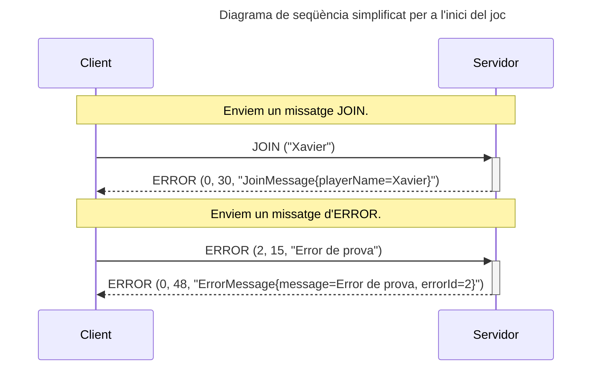
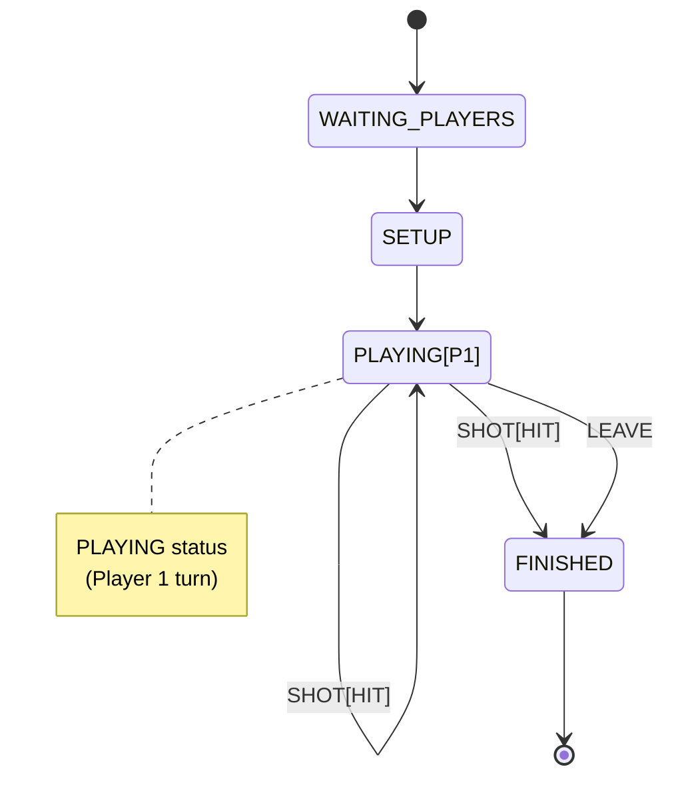
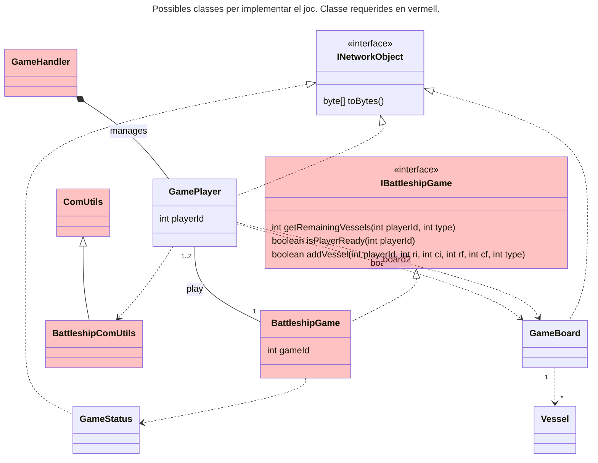
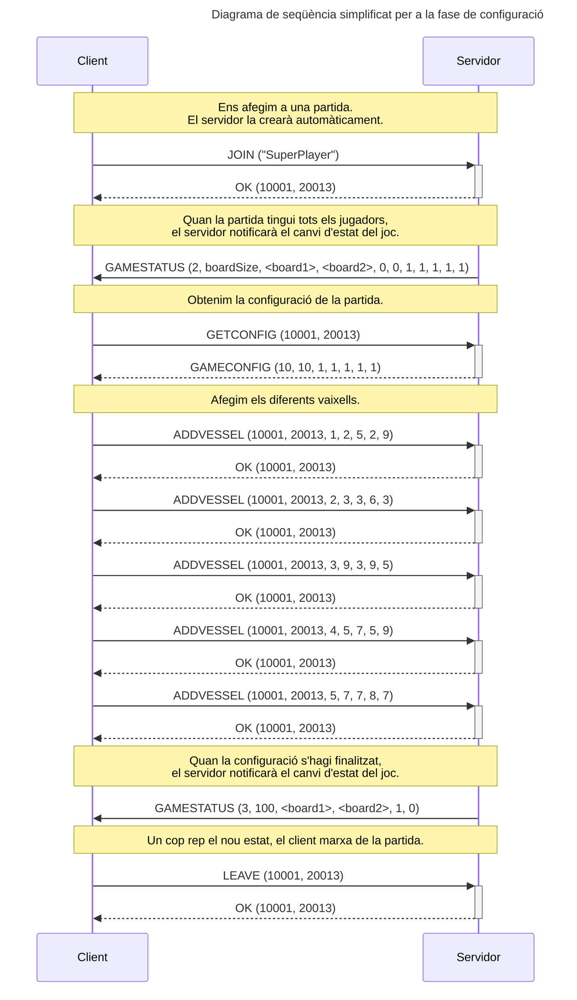
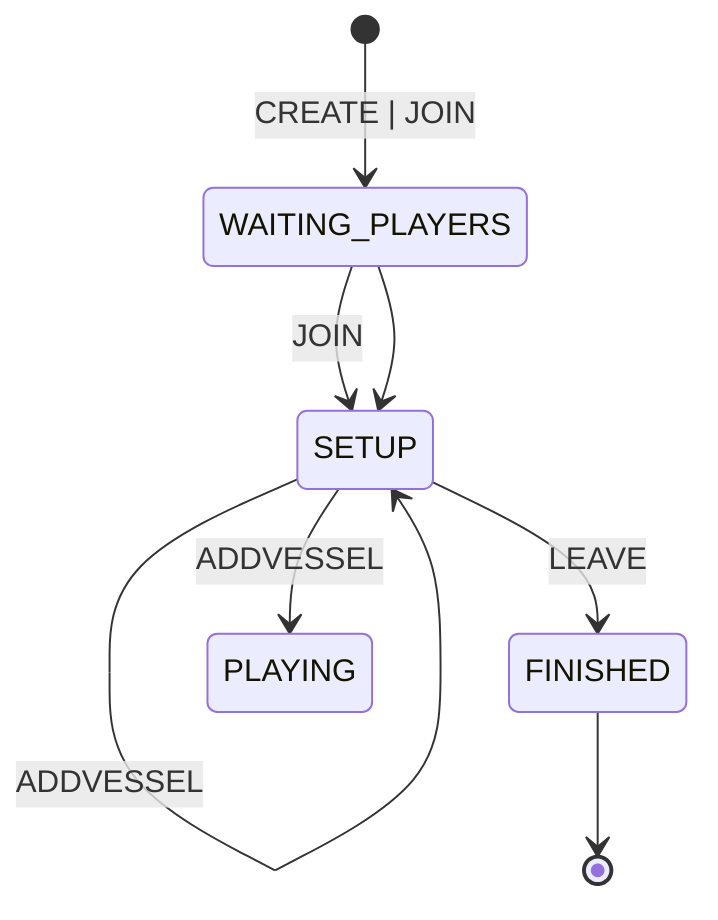

# Sessió 3

En la sessió anterior es va implementar la fase inicial i de configuració de la partida. En aquesta sessió revisarem alguns aspectes clau dels sockets i finalitzarem el joc.

## Objectius

- Verificar codificació missatges.
- Gestionar timeout i errors de socket.
- Implementar la dinàmica del joc.

**NOTA:** En aquesta sessió seguim assumint les següents simplificacions:
  - Partides un sol jugador
  - No es verifica que el nom del jugador no existeixi [Opcional]

## Verificar codificació missatges

En sessions anteriors vas implementar els missatges, conificant-ne la informació i simulant el seu enviament i decodificació en les proves unitàries. Això et garanteix que la teva implementació és coherent, però no que sigui correcta. Per facilitar la verificació de la codificació dels missatges abans de la sessió de proves creuades, us facilitem un __Servidor__ de prova, el qual en rebre un missatge retorna un **ERROR** amb una descripció en format **string** del missatge rebut. Fixeu-vos en els següents exemples:

Fixeu-vos que el servidor de prova no fa cap acció, simplement llegeix el missatge i el retorna com a string. Per tant, vosaltres heu d'assegurar-vos que els paràmetres que li passeu son coherents. 

**Nota:** Quan el __Servidor__ rep el missatge **LEAVE**, a banda d'enviar el missatge d'error corresponent, tanca la connexió. Podeu utilitzar aquest cas per provar els errors en cas de desconnexió per part del servidor.

Les **dades de connexió** del servidor de proves us les facilitarem durant la sessió de laboratori, així com els períodes en que aquest estarà actiu.

## Gestió d'errors al socket

Fins ara ens hem centrat principalment en l'establiment de la connexió per part del __Client__ i la seva acceptació per part del __Servidor__. A través de la classe **ComUtils** (o la seva derivada **BattleshipComUtils**) hem utilitzat el socket de comunicació per tal d'intercanviar els missatges del protocol entre __Client__ i __Servidor__, però no ens hem parat a controlar les diferents situacions que ens podem trobar durant una partida. En concret, us demanem que:

- **timeout:** Cada cert temps (màxim 30 segons) s'ha de comprovar que la connexió segueix activa.
- **desconnexió:** S'ha de gestionar el cas en que la connexió es tanca. Si intentem escriure en una connexió tancada tindrem errors que cal gestionar, especialment en el cas del __Servidor__.
- **tancar el socket:** Quan un socket ja no sigui necessàri, caldrà tancar-lo per alliberar els recursos que està utilitzant.

Reviseu la documentació del **Socket** per veure quins mètodes teniu disponibles de cara a poder gestionar aquestes situacions. 

**Nota:** Per simplificar, no s'implementarà la reconnexió mitjançant el missatge **REJOIN**. En comptes d'això, si el __Client__ detecta que s'ha desconnectat del servidor, mostrarà un missatge a l'usuari indicant-ho i donant per finalitzada la partida. Si el __Servidor__ detecta que un __Client__ s'ha desconnectat, finalitzarà el **Thread** associat a aquest client i la partida (en cas de **multi jugador** haurà de notificar l'altre jugador de que la partida ha finalitzat i que és el guanyador).

## Dinàmica de joc

En aquesta sessió cal començar a implementar la dinàmica del joc, en que els jugadors es van alternant intentant enfonsar els vaixells de l'oponent. Us recomanem que comencem amb la part del jugador 1, o sigui, sense alternar de jugador. Es tracta dels estats de joc del diagrama d'estats (podeu veure el diagrama complet a la [descripció del joc](../Guies/battleship.md)):

Seguint amb l'estructura de la sessió anterior, cada jugador (en aquest cas només en tindrem un) haurà de tenir accés a la classe `BattleshipGame` que implementarà la dinàmica del joc. Per realitzar aquesta sessió, es demana que implementeu com a mínim els següents mètodes:

- **int getActivePlayer():** Retorna l'identificador del jugador actiu. Donat que en aquesta sessió us demanem fer la part sense transicions, podeu assumir que sempre retorna el `playerId` assignat al jugador 1.
- **int getActivePlayer():** Retorna l'identificador `playerId`del jugador actiu. en cas que la partida hagi finalitzat (estat ).
- **int getWinPlayer():** Retorna l'identificador `playerId` del jugador guanyador. En cas qeu no s'hagi finalitzat la partida retornarà un `-1`.
- **boolean isBot(int playerId):** Retorna `true` si el jugador amb l'identificador donat és un jugador amb IA, o `false` si és humà.
- **int shot(int playerId, int r, int c):** Aquest mètode efectua una jugada en nom del jugador amb l'identificador donat. Retorna un valor enter indicant el resultat de la jugada: miss (0), hit(1), sunk(2). En cas d'error, retornarà un -1.
- **int shot(int playerId):** Aquest mètode implementa una jugada automàtica per part d'un jugador `bot`. 
- **void endGame():** Finalitza la partida i notifica els jugadors d'aquest fet.

### Treball fora del laboratori:

Continuant el treball al laboratori, de cara a la setmana següent es demana que implementeu la fase de configuració, en la qual els jugadors aniran posant els seus vaixells al tauler de joc.

## Fase de configuració

En aquesta fase els jugadors ubiquen al tauler els seus vaixells. Seguint amb l'esquema de les tasques al laboratori, a continuació es mostra el diagrama de classes amb les classes que poden estar involucrades (recordeu que moltes de les classes són opcionals). Dins la definició de la interfície `IBattleshipGame` us detallem els mètodes que caldrà implementar.

I seguint l'esquema del protocol mostrat a la [descripció de la pràctica](../Guies/battleship.md), volem implementar la següent part:

Fixeu-vos que seguim assumint que la partida és per a **un sol jugador** i que el servidor **crea la partida automàticament**. Un cop el __Client__ rep la notificació de que la partida ha modificat el `gameState` a `SETUP(2)`, iniciarà la fase de configuració:

- el __Client__ demanarà la configuració de la partida mitjançant un missatge `GETCONFIG`. El __Servidor__ li contestarà amb un missatge `GAMECONFIG` indicant la mida del tauler i els vaixells de cada tipus que es poden posar. Depenent de la vostra implementació, aquesta informació la podeu tenir guardada directament a l'objecte de partida `BattleshioGame` o en alguna altra classe.
- el __Client__ anirà ubicant els vaixells en el tauler, enviant missatges de tipus `ADDVESSEL` al __Servidor__. Per cada vaixell, el __Servidor__ verificarà que la informació és correcta i en tal cas li contestarà al __Client__ amb un missatge `OK`. Si la informació no és correcta, retornarà un missatge de tipus `ERROR` del tipus que toqui (veure [descripció missatges d'error](../Guies/errors.md))
- cada cop que un jugador hagi finalitzat d'ubicar els seus vaixells, el __Servidor__ notificarà a tots els jugadors sobre el canvi en l'estat amb un missatge `GAMESTATUS`. Quan tots els jugadors han finalitzat d'ubicar els vaixells, aquest missatge `GAMESTATUS` indicarà que la partida ha canviat a l'estat `PLAYING (3)`. 
- en el cas d'un sol jugador podeu ometre el missatge en que el __Servidor__ notifica que el jugador `IA`ha ubicat els vaixells, deixant els vaixells ja ubicats en el moment de la creació de la partida. En cas contrari, heu de buscar un moment en que es fassi l'assignació i s'enviï aquest canvi d'estat.

**NOTA:** En aquesta fase de la implementació, ja heu de tenir implementat el tauler, per tant, la codificació del tauler hauria de ser la descrita en la [definició del tauler](../Guies/board.md).

A continuació es detallen les implementacions més importants als dos costats:

### Servidor

El servidor haurà de gestionar la inicialització del tauler per part del jugador humà i de l'automàtic. Es tracta dels estats inicials del diagrama d'estats (podeu veure el diagrama complet a la [descripció del joc](../Guies/battleship.md)):

Seguint amb la implementació de la classe `BattleshipGame`, caldrà implementar els següents mètodes:

- **int getRemainingVessels(int playerId, int type):** Retorna el nombre de vaixells d'un determinat tipus, que li falta posar en el tauler al jugador amb el `playerId` indicat. 
- **boolean isPlayerReady(int playerId):** Retorna `true` si el jugador amb el `playerId` indicat ja ha ubicat tots els vaixells i per tant està a punt de començar la partida, o `false` en cas contrari.
- **boolean addVessel(int playerId, int ri, int ci, int rf, int cf, int type):** Afegeix un vaixell al tauler del jugador el `playerId` indicat. Retorna `true` si el vaixell s'ha pogut afegir o `false`en cas contrari.

A més a més, caldrà gestionar la petició de la configuració del joc via el missatge `GETCONFIG`.

### Client

El client haurà d'implementar el menú de configuració, al que es mourà en rebre el canvi d'estat via un missatge `GAMESTATUS`. Les opcions en aquest menú poden ser:

  - **1.- Ubicar un vaixell:** El client demanarà la informació del vaixell a ubicar i enviarà la comanda `ADDVESSEL` al servidor. Per facilitar aquesta acció, es pot mostrar una representació del tauler.
  - **2.- Sortir:** El client enviarà la comanda `LEAVE` al servidor i finalitzarà la seva execució.

