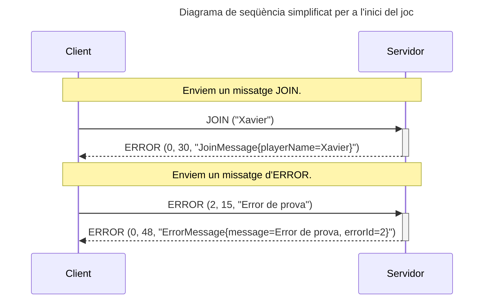
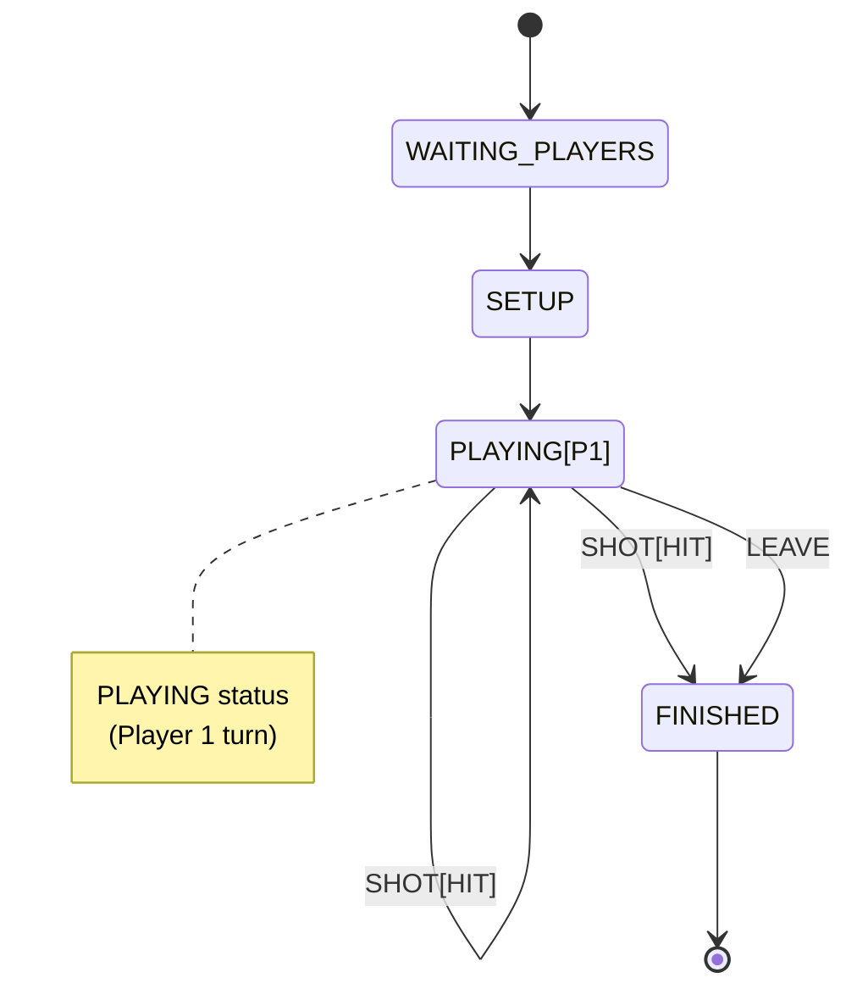

# Sessió 3

En la sessió anterior es va implementar la fase inicial i de configuració de la partida. En aquesta sessió revisarem alguns aspectes clau dels sockets i finalitzarem el joc.

## Objectius

- Verificar codificació missatges.
- Gestionar timeout i errors de socket.
- Implementar la dinàmica del joc.

**NOTA:** En aquesta sessió seguim assumint les següents simplificacions:
  - Partides un sol jugador
  - No es verifica que el nom del jugador no existeixi [Opcional]

## Verificar codificació missatges

En sessions anteriors vas implementar els missatges, conificant-ne la informació i simulant el seu enviament i decodificació en les proves unitàries. Això et garanteix que la teva implementació és coherent, però no que sigui correcta. Per facilitar la verificació de la codificació dels missatges abans de la sessió de proves creuades, us facilitem un __Servidor__ de prova, el qual en rebre un missatge retorna un **ERROR** amb una descripció en format **string** del missatge rebut. Fixeu-vos en els següents exemples:

Fixeu-vos que el servidor de prova no fa cap acció, simplement llegeix el missatge i el retorna com a string. Per tant, vosaltres heu d'assegurar-vos que els paràmetres que li passeu siguin coherents. 

**Nota:** Quan el __Servidor__ rep el missatge **LEAVE**, a banda d'enviar el missatge d'error corresponent, tanca la connexió. Podeu utilitzar aquest cas per provar els errors en cas de desconnexió per part del servidor.

Per utilitzar el **servidor de proves** cal que utilitzeu la següent configuració:
- **host:** sd.xbaro.eu
- **port:** 22026

Intentarem mantenir el servidor actiu el màxim de temps possible, en cas de que no us funcioni, notifiqueu-ho al vostre professor de laboratori.

## Gestió d'errors al socket

Fins ara ens hem centrat principalment en l'establiment de la connexió per part del __Client__ i la seva acceptació per part del __Servidor__. A través de la classe **ComUtils** (o la seva derivada **BattleshipComUtils**) hem utilitzat el socket de comunicació per tal d'intercanviar els missatges del protocol entre __Client__ i __Servidor__, però no ens hem parat a controlar les diferents situacions que ens podem trobar durant una partida. En concret, us demanem que:

- **timeout:** Cada cert temps (màxim 30 segons) s'ha de comprovar que la connexió segueix activa.
- **desconnexió:** S'ha de gestionar el cas en que la connexió es tanca. Si intentem escriure en una connexió tancada tindrem errors que cal gestionar, especialment en el cas del __Servidor__.
- **tancar el socket:** Quan un socket ja no sigui necessàri, caldrà tancar-lo per alliberar els recursos que està utilitzant.

Reviseu la documentació del **Socket** per veure quins mètodes teniu disponibles de cara a poder gestionar aquestes situacions. 

**Nota:** Per simplificar, no s'implementarà la reconnexió mitjançant el missatge **REJOIN**. En comptes d'això, si el __Client__ detecta que s'ha desconnectat del servidor, mostrarà un missatge a l'usuari indicant-ho i donant per finalitzada la partida. Si el __Servidor__ detecta que un __Client__ s'ha desconnectat, finalitzarà el **Thread** associat a aquest client i la partida (en cas de **multi jugador** haurà de notificar l'altre jugador de que la partida ha finalitzat i que n'és el guanyador).

## Dinàmica de joc

En aquesta sessió cal començar a implementar la dinàmica del joc, en que els jugadors es van alternant intentant enfonsar els vaixells de l'oponent. Us recomanem que comencem amb la part del jugador 1, o sigui, sense alternar de jugador. Es tracta dels estats de joc del diagrama d'estats (podeu veure el diagrama complet a la [descripció del joc](../Guies/battleship.md)):

Seguint amb l'estructura de la sessió anterior, cada jugador (en aquest cas només en tindrem un) haurà de tenir accés a la classe `BattleshipGame` que implementarà la dinàmica del joc. Per realitzar aquesta sessió, es demana que implementeu com a mínim els següents mètodes:

- **int getActivePlayer():** Retorna l'identificador del jugador actiu. Donat que en aquesta sessió us demanem fer la part sense transicions, podeu assumir que sempre retorna el `playerId` assignat al jugador 1. En cas que la partida hagi finalitzat (estat `FINISHED`), retornarà `-1`.
- **int getWinPlayer():** Retorna l'identificador `playerId` del jugador guanyador. En cas qeu no s'hagi finalitzat la partida retornarà un `-1`.
- **int shot(int playerId, int r, int c):** Aquest mètode efectua una jugada en nom del jugador amb l'identificador donat. Retorna un valor enter indicant el resultat de la jugada: miss (0), hit(1), sunk(2). En cas d'error, retornarà un -1.
- **void endGame():** Finalitza la partida i notifica els jugadors d'aquest fet.

### Treball fora del laboratori:

Finalitzar el que no s'hagi pogut realitzar durant la sessió de laboratori, i implementar proves unitàries sobre `BattleshipGame` per comprovar que la part implementada funciona correctament.
