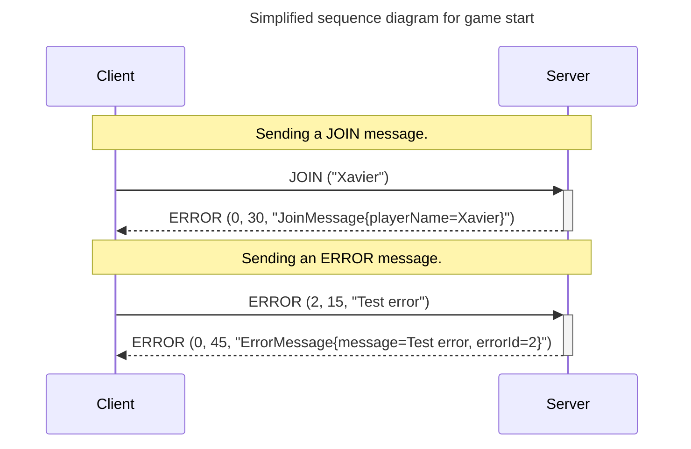
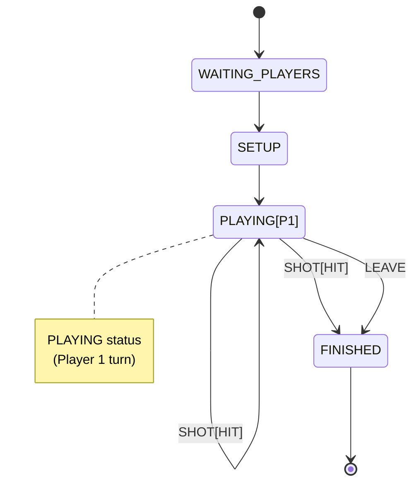

# Session 3

In the previous session, we implemented the initial phase and game setup. In this session, we will review some key aspects of sockets and finalize the game.

## Objectives

- Verify message encoding.
- Handle socket timeouts and errors.
- Implement game dynamics.

**NOTE:** In this session, we continue assuming the following simplifications:
  - Single-player games.
  - The player's name is not checked for uniqueness [Optional].

## Verify Message Encoding

In previous sessions, you implemented messages by encoding their information and simulating their sending and decoding in unit tests. This ensures that your implementation is consistent, but not necessarily correct. To facilitate the verification of message encoding before the cross-testing session, we provide you with a __Test Server__, which, upon receiving a message, returns an **ERROR** with a **string** description of the received message. Consider the following examples:

Note that the test server does not perform any action; it simply reads the message and returns it as a string. Therefore, you must ensure that the parameters you send are coherent.

**Note:** When the __Server__ receives the **LEAVE** message, in addition to sending the corresponding error message, it closes the connection. You can use this case to test errors in case of server disconnection.

To use the **test server**, configure it as follows:
- **host:** sd.xbaro.eu
- **port:** 22026

We will try to keep the server active as long as possible. If it does not work for you, notify your lab instructor.

## Handling Socket Errors

So far, we have mainly focused on establishing the connection from the __Client__ and its acceptance by the __Server__. Using the **ComUtils** class (or its derived **BattleshipComUtils**), we have used the communication socket to exchange protocol messages between __Client__ and __Server__, but we have not addressed the various situations that may arise during a game. Specifically, we ask you to:

- **Timeout:** Every certain period (maximum 30 seconds), check if the connection is still active.
- **Disconnection:** Handle cases where the connection is closed. If we try to write to a closed connection, we will encounter errors that need to be managed, especially on the __Server__ side.
- **Close the socket:** When a socket is no longer needed, it should be closed to free up resources.

Review the **Socket** documentation to see which methods are available for managing these situations.

**Note:** To simplify, the reconnection via the **REJOIN** message will not be implemented. Instead, if the __Client__ detects that it has been disconnected from the server, it will display a message to the user indicating this and consider the game finished. If the __Server__ detects that a __Client__ has disconnected, it will terminate the **Thread** associated with that client and the game (in case of **multiplayer**, it must notify the other player that the game has ended and they are the winner).

## Game Dynamics

In this session, we need to start implementing the game dynamics, where players take turns trying to sink the opponent's ships. We recommend starting with player 1's part, meaning without switching players. This corresponds to the game states in the state diagram (you can see the complete diagram in the [game description](../Guides/battleship_en.md)):

Following the structure of the previous session, each player (in this case, only one) must have access to the `BattleshipGame` class, which will implement the game dynamics. For this session, you are required to implement at least the following methods:

- **int getActivePlayer():** Returns the identifier of the active player. Since we are asking you to implement the part without transitions in this session, you can assume that it always returns the `playerId` assigned to player 1. If the game has finished (state `FINISHED`), it will return `-1`.
- **int getWinPlayer():** Returns the `playerId` of the winning player. If the game has not yet finished, it will return `-1`.
- **int shot(int playerId, int r, int c):** This method makes a move on behalf of the player with the given identifier. It returns an integer value indicating the result of the move: miss (0), hit (1), sunk (2). In case of an error, it returns `-1`.
- **void endGame():** Ends the game and notifies the players of this event.

### Work Outside the Laboratory

Complete any unfinished work from the lab session and implement unit tests on `BattleshipGame` to verify that the implemented part works correctly.

