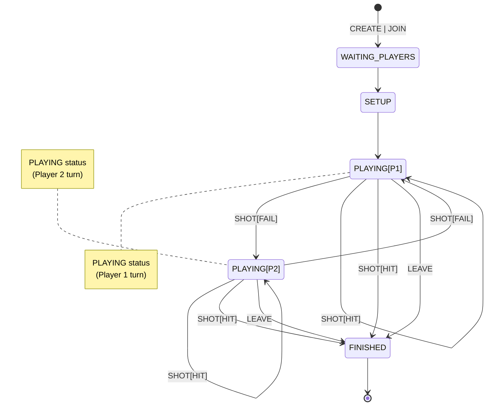
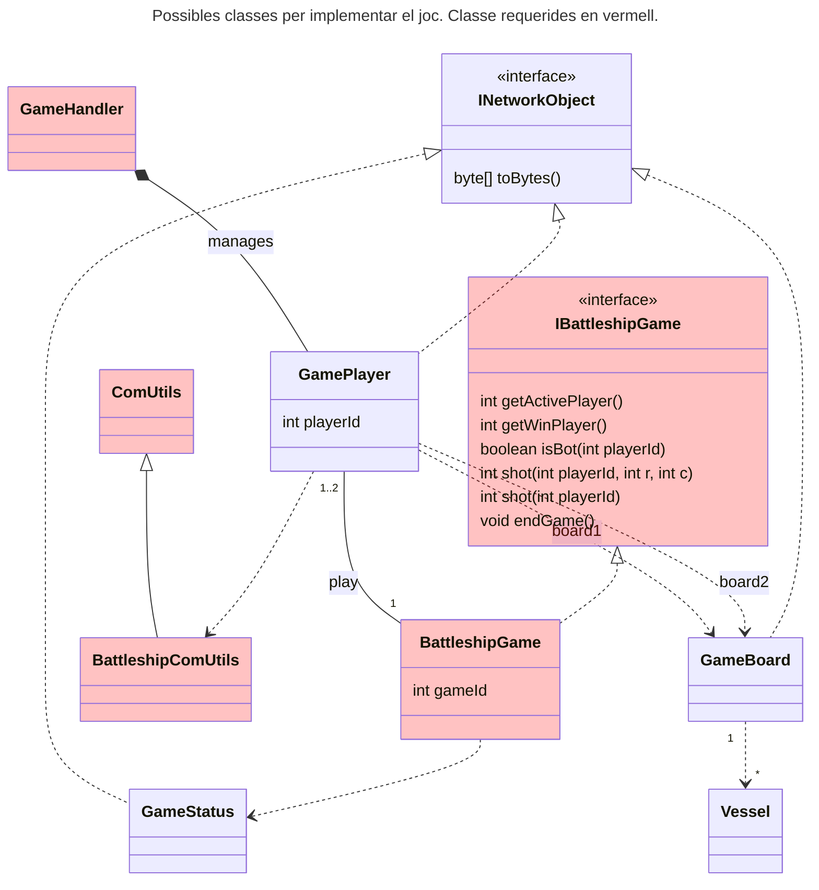

# Sessió 4

En la sessió anterior es va començar a implementar la fase de joc. En aquesta sessió l'objectiu és finalitzar la pràctica.

## Objectius

- Finalitzar la implementació de la dinàmica del joc.
- [Opcional] Implementar el mode multi-jugador

**NOTA:** En aquesta sessió seguim assumint les següents simplificacions:
  - Partides un sol jugador (veure part opcional de multi-jugador)
  - No es verifica que el nom del jugador no existeixi [Opcional]

## Interacció amb l'usuari

Durant la partida, el __Client__ té dues fonts d'entrada de dades, la del socket que comunica amb el __Servidor__ i la del teclat que utilita l'usuari. Per evitar que el l'aplicació quedi penjada, és molt important que s'identifiquin els punts de bloqueig i es gestionin correctament. Us donem algunes guies:

- Només llegir de teclat quan requreim interacció de l'usuari. Normalment el moment de joc ens indica si necessitem preguntar a l'usuari per alguna informació (tipus i posició del vaixell, cel·la on disparar, ...). La única opció que no podem predir és si l'usuari vol abandonar la partida. Podem utilitzar Ctrl-C per a la finalització de la partida, de forma que no ens cal mantenir un menú de joc. Cal gestionar correctament la interrupció generada i acabar la partida correctament.

- Gestionar correctament els timeouts dels Sockets per detectar problemes amb la connexió.

Amb aquestes dues precaucions, podem mantenir l'aplicació __Client__ simple. Altrament requerirem la utilització de múltiples Threads, i caldrà gestionar la serva coordinació, augmentant la complexitat del programa.

## Dinàmica de joc

En aquesta sessió cal implementar l'alternància en el joc entre els jugadors. En el cas del jugador **bot**, cal implementar la tirada automàtica. Es tracta dels estats de joc del diagrama d'estats (podeu veure el diagrama complet a la [descripció del joc](../Guies/battleship.md)):

Seguint amb l'estructura de la sessió anterior, cada jugador haurà de tenir accés a la classe `BattleshipGame` que implementarà la dinàmica del joc. Per realitzar aquesta sessió, es demana que implementeu o modifiqueu els següents mètodes:

- **int getActivePlayer():** Retorna l'identificador `playerId` del jugador actiu. En cas que la partida hagi finalitzat (estat `FINISHED`), retornarà `-1`.
- **int getWinPlayer():** Retorna l'identificador `playerId` del jugador guanyador. En cas qeu no s'hagi finalitzat la partida retornarà un `-1`.
- **boolean isBot(int playerId):** Retorna `true` si el jugador amb l'identificador donat és un jugador amb IA, o `false` si és humà.
- **int shot(int playerId, int r, int c):** Aquest mètode efectua una jugada en nom del jugador amb l'identificador donat. Retorna un valor enter indicant el resultat de la jugada: miss (0), hit(1), sunk(2). En cas d'error, retornarà un -1.
- **int shot(int playerId):** Aquest mètode implementa una jugada automàtica per part d'un jugador `bot`. 
- **void endGame():** Finalitza la partida i notifica els jugadors d'aquest fet.

## Multiples jugadors

Habilitar el nostre __Servidor__ per a partides multi-jugador requereix que el __Servidor__ mantingui la llista de partides i pugui detectar a quina partida multi-jugador falten jugadors, per poder assignar-los. Amb tot, per simplificar us proposem que assumiu unes **simplificacions**:

- Quan el servidor arranca en mode **multi-jugador**, totes les partides són **multi-jugador**. 
- El **primer** __Client__ que es connecta crea la partida (igual que es fa amb la versió amb **un-jugador**). El **següent** __Client__ que es connecti s'afegirà a la partida creada pel primer __Client__. El **tercer** __Client__ tornarà a crear una partida i el **quart** s'afegirà a la del **tercer**. I així succesivament. 

Tenint això en compte, la implementació queda molt similar a la que heu realitzat per a un sol jugador. Per implementar aquesta funcionalitat, heu de:

1. Modifica el __Servidor__ per tal que accepti una nova opció `--multiplayer` com a paràmetre d'entrada (a més a més de l'actual `-p <port>`). Fixa't que aquesta opció no té arguments.
2. Modifica el __Servidor__ per tal que les partides es crein amb el paràmetre `AI` desactivat.
3. Modifica el __Servidor__ per tal que els **jugadors parells** s'afegeixin a la partida creada pel **jugador previ**.

### Treball fora del laboratori:

Finalitzar el que no s'hagi pogut realitzar durant la sessió de laboratori, i implementar proves unitàries sobre `BattleshipGame` per comprovar que la part implementada funciona correctament.
