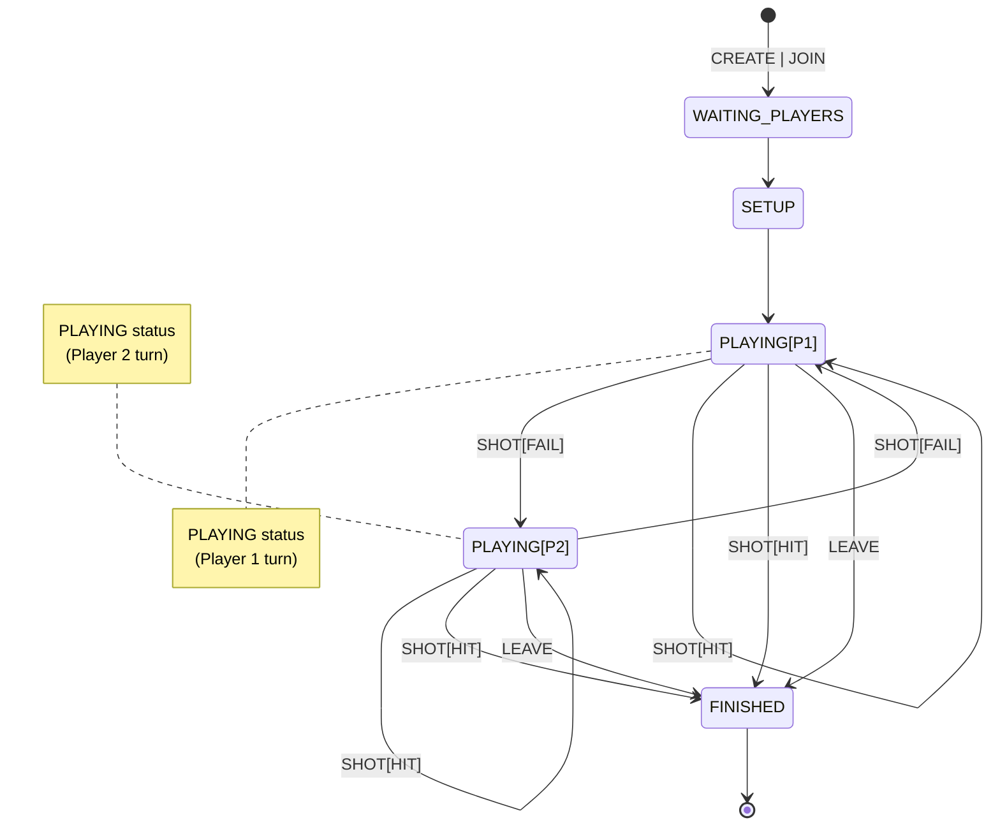
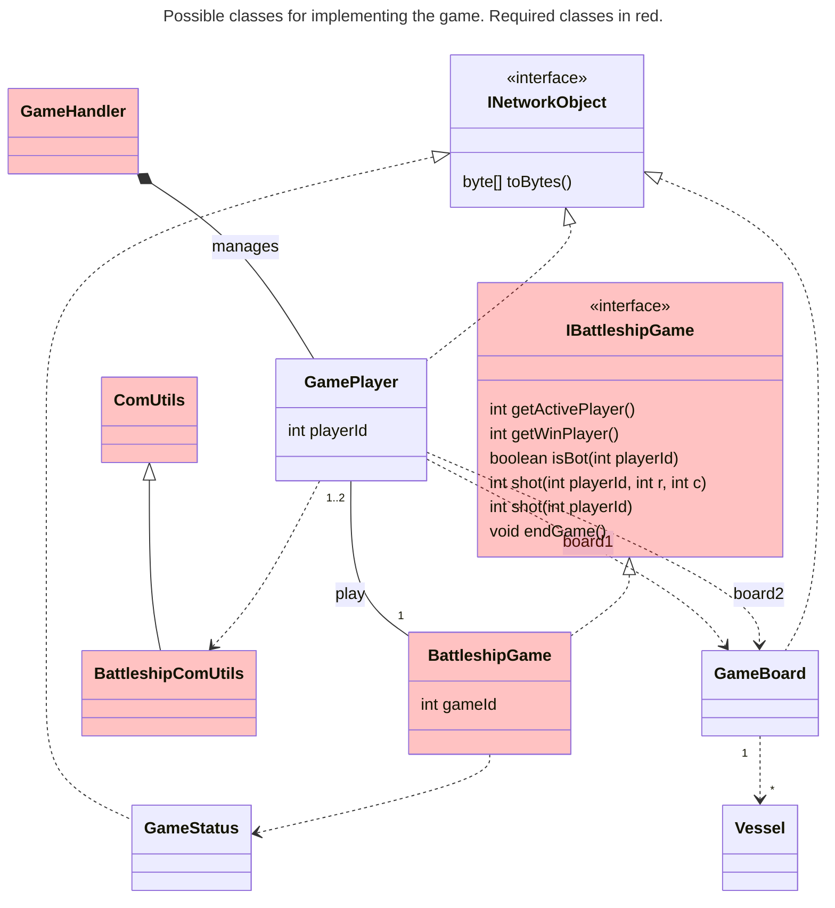

# Session 4

In the previous session, the game phase implementation was started. In this session, the goal is to complete the practice.

## Objectives

- Complete the implementation of the game dynamics.
- [Optional] Implement the multiplayer mode.

**NOTE:** In this session, we continue assuming the following simplifications:
  - Single-player games (see optional multiplayer section).
  - No verification that the player's name does not already exist [Optional].

## User Interaction

During the game, the __Client__ has two sources of data input: the socket that communicates with the __Server__ and the keyboard used by the user. To prevent the application from freezing, it is crucial to identify blocking points and manage them correctly. Here are some guidelines:

- Only read from the keyboard when user interaction is required. Usually, the game state indicates whether we need to ask the user for some information (type and position of the vessel, cell to shoot at, etc.). The only unpredictable option is if the user wants to leave the game. We can use Ctrl-C to terminate the game, so we don't need to maintain an in-game menu. It is essential to properly handle the generated interruption and end the game correctly.

- Properly manage socket timeouts to detect connection issues.

With these two precautions, we can keep the __Client__ application simple. Otherwise, we would need to use multiple Threads and manage their coordination, increasing the complexity of the program.

## Game Dynamics

In this session, it is necessary to implement player alternation during the game. In the case of the **bot** player, automatic moves must be implemented. These correspond to the game states in the state diagram (you can see the full diagram in the [game description](../Guides/battleship_en.md)):

## Required Methods

Following the structure of the previous session, each player must have access to the `BattleshipGame` class, which will implement the game dynamics. For this session, you are required to implement or modify the following methods:

- **int getActivePlayer():** Returns the `playerId` of the active player. If the game has ended (`FINISHED` state), it will return `-1`.
- **int getWinPlayer():** Returns the `playerId` of the winning player. If the game has not ended yet, it will return `-1`.
- **boolean isBot(int playerId):** Returns `true` if the player with the given ID is an AI player, or `false` if they are human.
- **int shot(int playerId, int r, int c):** This method executes a move on behalf of the given player. It returns an integer indicating the result of the move: miss (0), hit (1), sunk (2). In case of an error, it will return `-1`.
- **int shot(int playerId):** This method implements an automatic move for a `bot` player.
- **void endGame():** Ends the game and notifies the players of this event.

## Multiple Players

Enabling our __Server__ for multiplayer games requires the __Server__ to maintain a list of games and detect which multiplayer game needs players to assign them accordingly. However, to simplify, we propose assuming the following **simplifications**:

- When the server starts in **multiplayer mode**, all games are **multiplayer**.
- The **first** __Client__ that connects creates the game (just like in the single-player version). The **next** __Client__ that connects will join the game created by the first __Client__. The **third** __Client__ will create a new game, and the **fourth** will join the third's game. And so on.

Considering this, the implementation remains very similar to what you have done for single-player mode. To implement this functionality, you must:

1. Modify the __Server__ to accept a new option `--multiplayer` as a command-line parameter (in addition to the existing `-p <port>`). Note that this option has no arguments.
2. Modify the __Server__ so that games are created with the `AI` parameter disabled.
3. Modify the __Server__ so that **even-numbered players** join the game created by the **previous player**.

### Work Outside the Lab:

Complete anything that couldn't be finished during the lab session and implement unit tests on `BattleshipGame` to verify that the implemented parts work correctly.

