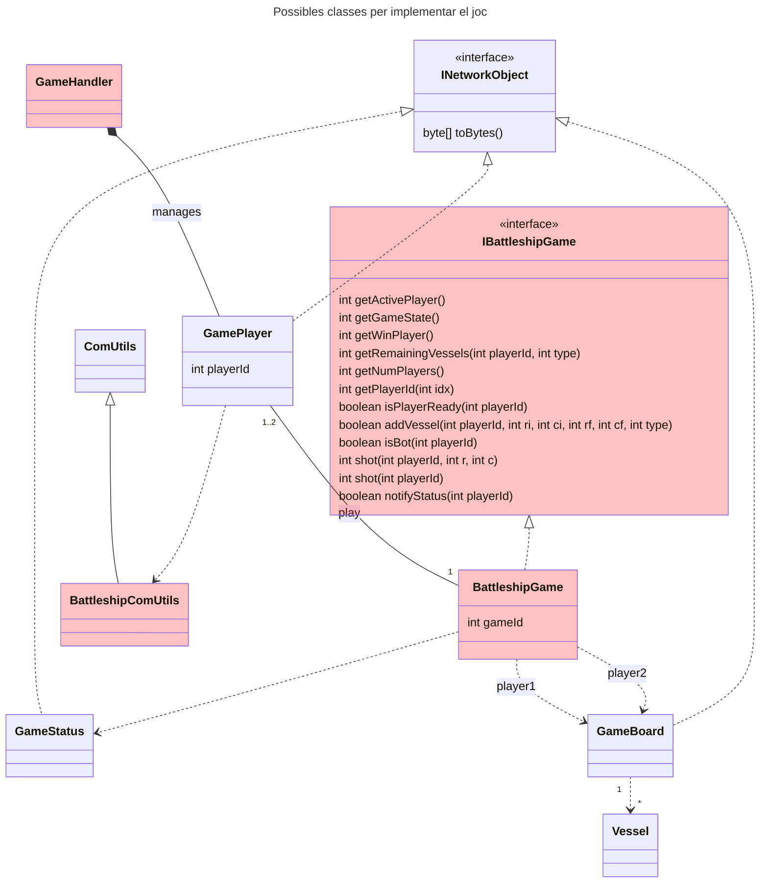

En aquesta sessió clarificarem els dubtes sobre la codificació dels missatges i el protocol en si. També començarem la codificació de la pràctica.


### Sessió 1





#### Deures:
* Realitzar la funcio per llegir el tipus de dada "string variable"
* Fer les primeres trames (Hello, Admit, etc) a Servidor i Client (cadascuna on toqui) i comprovar la comunicació entre ambdós.

### Sessió 2

* Acabar amb els dubtes de Git / GitHub: settejar bé els projectes, entendre com es vol treballar amb branques i PR's.
* Organització del codi: per on començar

**Deures**

* Mínim enviar i rebre 4 trames
* Començar a adaptar Servidor per a que sigui multi-thread

### Sessió 3

* Update de l'idSessió al protocol!
* Check per parelles de l'estat de la pràctica, GitHub i deures

**Deures**

* Servidor multithread
* Resta de trames

### Execució 

L'execució seguirà obligatòriament els següents paràmetres:

**Servidor**
* -p: port a on establir-se

**Client**

* -h: IP o nom de la màquina a on connectar-se
* -p: port on trobar el servidor


```java
/**
 * Copy contructor for ComUtils.
 * 
 * @param obj  Input ComUtils obj.     
 */
public ComUtils(ComUtils obj){
    dataInputStream = obj.dataInputStream;
    dataOutputStream = obj.dataOutputStream;
}
```


```java
/**
 * Interface representing a Battleship game.
 * This interface provides methods for managing players, placing vessels,
 * taking shots, and retrieving game status.
 */
public interface IBattleshipGame {

    /**
     * Gets the ID of the active player.
     * 
     * @return the ID of the player whose turn it is.
     */
    int getActivePlayer();

    /**
     * Gets the current game state.
     * 
     * @return an integer representing the game state (see gameState description).
     */
    int getGameState();

    /**
     * Gets the playerId of the winning player if the game has ended.
     * 
     * @return the playerId of the winning player, or -1 if the game is still ongoing.
     */
    int getWinPlayer();

    /**
     * Gets the number of remaining vessels of a specific type for a given player.
     * 
     * @param playerId the ID of the player.
     * @param type the type of vessel.
     * @return the number of remaining vessels of the specified type.
     */
    int getRemainingVessels(int playerId, int type);

    /**
     * Gets the total number of players in the game.
     * 
     * @return the number of players.
     */
    int getNumPlayers();

    /**
     * Gets the player ID at the specified index.
     * 
     * @param idx the index of the player.
     * @return the player ID corresponding to the given index.
     */
    int getPlayerId(int idx);

    /**
     * Checks whether a player is ready to start the game.
     * 
     * @param playerId the ID of the player.
     * @return true if the player is ready, false otherwise.
     */
    boolean isPlayerReady(int playerId);

    /**
     * Attempts to add a vessel to the board for a given player.
     * 
     * @param playerId the ID of the player.
     * @param ri the starting row index.
     * @param ci the starting column index.
     * @param rf the ending row index.
     * @param cf the ending column index.
     * @param type the type of vessel.
     * @return true if the vessel was successfully placed, false otherwise.
     */
    boolean addVessel(int playerId, int ri, int ci, int rf, int cf, int type);

    /**
     * Checks whether a player is a bot.
     * 
     * @param playerId the ID of the player.
     * @return true if the player is a bot, false otherwise.
     */
    boolean isBot(int playerId);

    /**
     * Processes a shot fired by a player at a specific location.
     * 
     * @param playerId the ID of the player taking the shot.
     * @param r the row index of the shot.
     * @param c the column index of the shot.
     * @return an integer representing the result of the shot: miss (0), hit(1), sunk(2). -1 in case of error.
     */
    int shot(int playerId, int r, int c);

    /**
     * Processes an automatic shot for a bot player.
     * 
     * @param playerId the ID of the bot player.
     * @return an integer representing the result of the shot: miss (0), hit(1), sunk(2). -1 in case of error.
     */
    int shot(int playerId);

    /**
     * Notifies the game status to a given player.
     * 
     * @param playerId the ID of the player.
     * @return true if the status notification was successful, false otherwise.
     */
    boolean notifyStatus(int playerId);

    /**
     * Player leave the game.
     * 
     * @param playerId the ID of the player.
     */
    void leaveGame(int playerId);

    /**
     * End the game
     */
    void endGame();


    
}

```